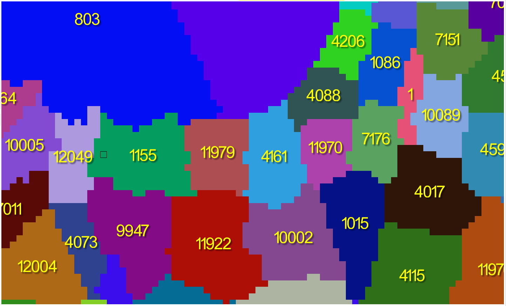

# [🠈](../lang=ru.md) | Навигация по карте

## Основные доступные действия для навигации и взаимодействия с картой

**Нажатие ЛКМ** - выбор (выделение) объекта на карте
   
  

  ---

**Нажатие SHIFT+ЛКМ** - множественный выбор (выделение) объектов на карте. Повторное нажатие на выделенный объект снимает с него выделение
   
  

  ---

**Нажатие ПКМ** - вторичный выбор (выделение) объекта и открытие контекстного меню с действиями (см. подробнее в: [Контекстное меню Карты](../context_menu/lang=ru.md))
   
  
  
  ---

**Вращение колеса мыши** - изменения уровня зума карты. Точка фокусировки камеры при зуме зависит от положения курсора мыши
   
  

  ---

**Зажатие колеса мыши и перемещение курсора** - изменение положения камеры относительно карты
   
  

  ---

**Нажатие Esc** - снятие выделения объекта(-ов)
   
  ---

**Нажатие Delete** - удаление выделенного объекта(-ов), если это возможно (к примеру, удаление узлов снабжения, железных догор, смежностей и т.п., но не провинций, областей, регионов и т.д.)