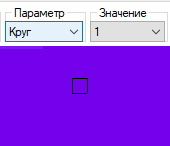
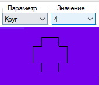
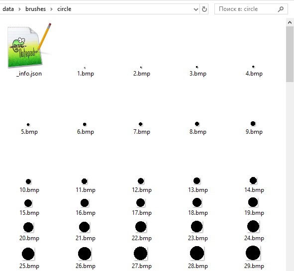
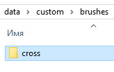
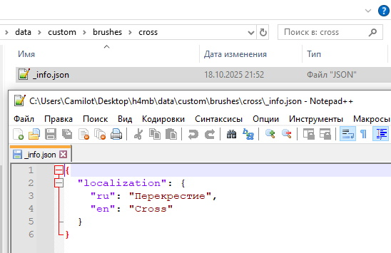
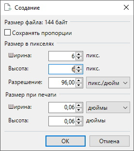
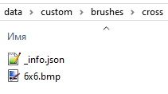
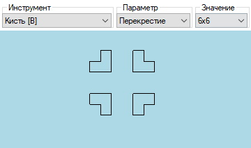

# [🠈](../lang=ru.md) | Кастомизация кистей

## Краткое описание системы кистей

По умолчанию в программе на данный момент доступен только один шаблон кисти - круг со 100 вариациями.

Изменение варианта используемого шаблона кисти (в данном случае - размера кисти) осуществляется двумя способами:
1. Выбор варианта кисти курсором через выпадающий список **Значение**
2. Через сочение **Вращение колеса мыши** с зажатой клавишей **[SHIFT]** (вращение вверх - увеличение размера кисти, вниз - уменьшение размера)




## Место хранение кистей

Данные доступных по умолчанию в программе кистей находятся в директории **"data/brushes/"**.

Создавать кастомные кисти рекомендуется в директории **"data/custom/brushes/"**, чтобы в будущем при обновлении версии программы случайно не перезаписать ваши кастомные кисти.

## Формат данных кистей

Каждая кисть представляет собой отдельную папку в директории **brushes**, в которой находятся:
1. Конфиг "_info.json" с основными параметрами кисти (в данный момент только локализация на разные языки)
2. Изображения с вариациями шаблона (*.bmp файлы с глубиной цвета 32 бит на пиксель)



## Создание кастомной кисти

В качестве примера создадим кастомную кисть "Перекрестие":

1. В директории **"data/custom/brushes/"** создадим папку **"cross"**

    

2. В созданной папке создадим файл **"_info.json"** и заполним в нём параметры кисти (локализацию в интерфейсе):
```
{
  "localization": {
    "ru": "Перекрестие",
    "en": "Cross"
  }
}
```


3. Откроем любой редактор изображений, **поддерживающий работу с альфа-каналом** (к примеру, приложение paint.NET) и создадим холс требуемого размера (к примеру, 6х6 пикселей)

    

4. Нарисуем нужный вариант кисти и сохраним его в ранее созданную папку **"data/custom/brushes/cross"** с названием **"6x6.bmp"**   

    **ВАЖНО:**
    1. Значение альфа-канала (прозрачности) пикселей, которые не должны учитываться (отрисовываться и участвовать при использовании кисте), должно равняться 0. Если пиксель будет хоть немного непрозрачен, программа учтёт его при загрузке варианта шаблона кисти
    2. Изображение варианта шаблона кисти должно сохраняться в формате **".bmp"** с глубиной цвета **32 бита**
    3. Вы можете добавлять сколько угодно вариантов шаблона кисти в её папку. Все они будут подгружены после перезапуска программы

    

5. В итоге содержимое папки кастомного шаблона кисти должно выглядеть примерно следующим образом:

    

6. После перезапуска программы вы сможете выбрать созданный вами кастомный шаблон кисти и его используемую вариацию

    