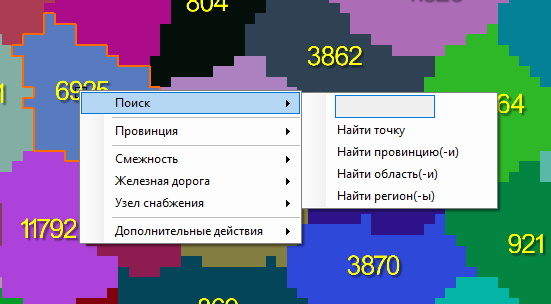
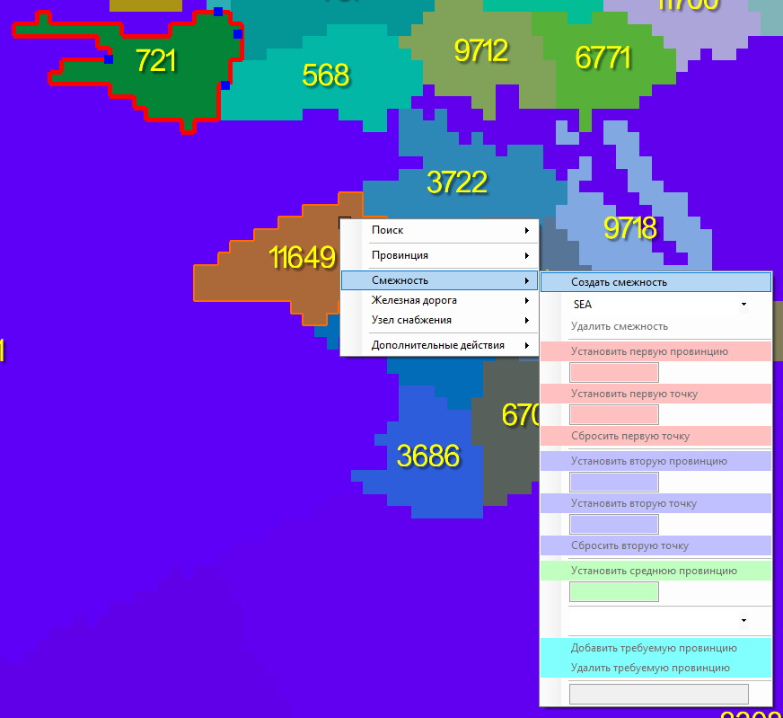
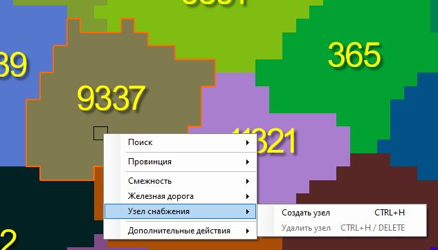
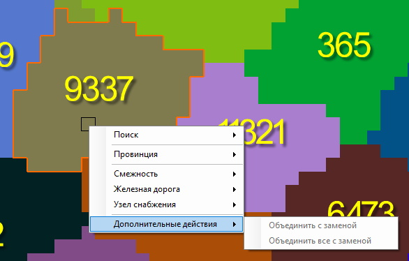

# [🠈](../lang=ru.md) | Контекстное меню Карты

Контекстное меню открывается при нажатии **[ПКМ]** по карте.

## Пункт меню "Поиск"

Пункт меню "Поиск" - позволяет выполнять быстрый поиск и, если это предусмотрено, выделение объектов на карте по данным, указанным в текстовом поле выпадающего окна.

1. Найти точку - фокусирует камеру на точке на карте, координаты которой указаны в текстовом поле в формате "x; y"
2. Найти провинцию(-и) - выделяет одну или группу провинций и фокусирует камеру на провинциях, id которых указаны в текстовом поле в формате "1 2 3" (пробел является символом-разделителем между id провинций)
3. Найти область(-и) - выделяет одну или группу областей (states) и фокусирует камеру на областях, id которых указаны в текстовом поле в формате "1 2 3" (пробел является символом-разделителем между id областей)
4. Найти регион(-и) - выделяет один или группу регионов (strategic regions) и фокусирует камеру на регионах, id которых указаны в текстовом поле в формате "1 2 3" (пробел является символом-разделителем между id регионов)

## Пункт меню "Провинция"

Пункт меню "Провинция" - выводит краткую информацию о провинции и даёт ещё один способ (помимо соответствующих инструментов, см. подробнее [Инструменты для работы с картой](/docs/tools/map/lang=ru.md)) для редактирования таких параметров провинции, как:
1. Принадлежность к области (state)
2. Принадлежность к региона (strategic region)
3. Тип провинции (land, sea, lake)
4. Прибрежность провинции (isCoastal)
5. Местность провинции (terrain)
6. Континент провинции (continent)
7. Значение очков победы в провинции (victory points)

## Пункт меню "Смежность"

Пункт меню "Смежность" - позволяет создавать, редактировать и удалять смежности (adjacencies) между провинциями (см. подробнее [Инструмент "Смежности"](/docs/tools/map/advanced/supply_hubs/lang=ru.md)).

Чтобы увидеть смежности на карте, включите в "Доп. слои" отображение смежностей.

## Пункт меню "Железная дорога"

Пункт меню "Железная дорога" - позволяет создавать, редактировать, разделять, соединять и удалять железные дороги (см. подробнее [Инструмент "Железные дороги"](/docs/tools/map/advanced/railways/lang=ru.md)). 

Чтобы увидеть железные дороги на карте, не забудьте включить их отображение в "Доп. слои".

## Пункт меню "Узел снабжения"

Пункт меню "Узел снабжения" - позволяет создавать и удалять узлы снабжения на карте (см. подробнее [Инструмент "Железные дороги"](/docs/tools/map/advanced/supply_hubs/lang=ru.md)). 

Чтобы увидеть узлы снабжения на карте, не забудьте включить их отображение в "Доп. слои".

## Пункт меню "Дополнительные действия"

Пункт меню "Дополнительные действия" - содержит в себе следующие действия:
1. Объединить с заменой - объединяет две выбранные провинции (см. подробнее [Инструмент "Объединение провинций"](/docs/tools/map/advanced/merge_provinces/lang=ru.md));
2. Объединить все с заменой - объединяет все выбранные провинции в группе (см. подробнее [Инструмент "Объединение провинций"](/docs/tools/map/advanced/merge_provinces/lang=ru.md)). 

Чтобы увидеть узлы снабжения на карте, не забудьте включить их отображение в "Доп. слои".

