# [🠈](../lang=ru.md) | Интерфейс карты

### В данной статье приведено краткое описание элементов владки для работы с игровой карты.

#### Основы навигации для работы с картой приведены в статье [Навигация по карте](./navigation/lang=ru.md)

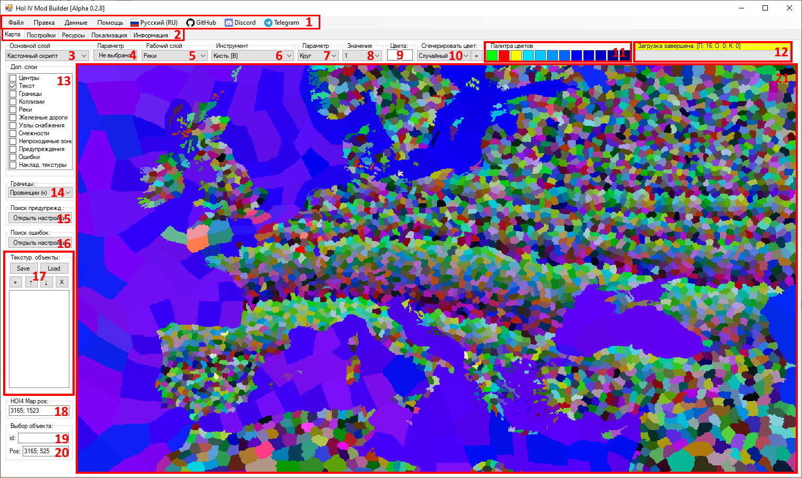


Описание элементов интерфейса карты:
---
- [1] Меню программы:
  
    Пункт "Файл" - основные действия для сохранения и загрузки данных

    

    <details>
    <summary><i>Подробнее</i></summary>
    
    
    
    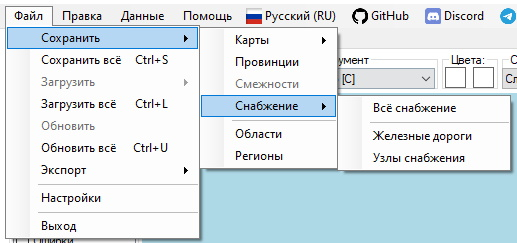
    
    
    
    </details>
    
    ---

    Пункт "Правка" - основные действия для изменения данных.

    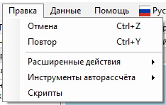

    <details>
    <summary><i>Подробнее</i></summary>
    
    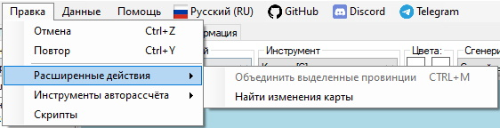
    
    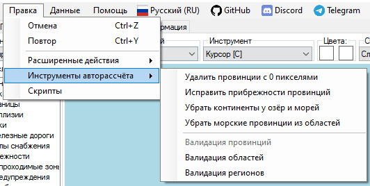

    </details>

    ---

    Пункт "Данные" - основные действия для просмотра данных и восстановления старых данных. Позволяет также изменить текущую активную Bookmark мода.

    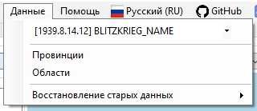

    <details>
    <summary><i>Подробнее</i></summary>

    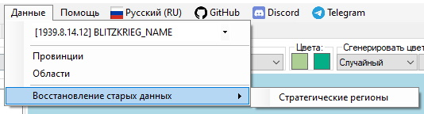
    
    </details>

    ---
    
    Пункт "Помощь" - открытие документации и основных данных о программе

    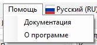

    ---
    
    Пункт "GitHub" - открывает страницу репозитория с исходным кодом и последними релизами программы на GitHub.

    ---

    Пункт "Discord" - открывает ссылку-приглашение на вступление в Discord-сервер программы.

    ---

    Пункт "Telegram" - открывает ссылку на Telegram-канал программы

    ---

    Пункт выбора языка - позволяет выбрать один из нескольких языков локализации в приложении

    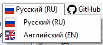
---
- [2] Вкладки редактора - на данный момент используется только ветка карты
---
- [3] Основной слой - определяет режим отрисовки основного слоя карты в программе

    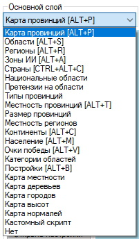

    <details>
    <summary><i>Подробнее</i></summary>

    Поддерживает отрисовку в следующих режимах:
    - Карта провинций (сочетание клавиш: ALT+P) - отрисовка провинций из provinces.bmp и definition.csv
    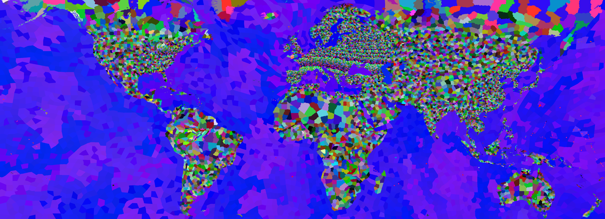
    - Области (сочетание клавиш: ALT+S) - отрисовка States
    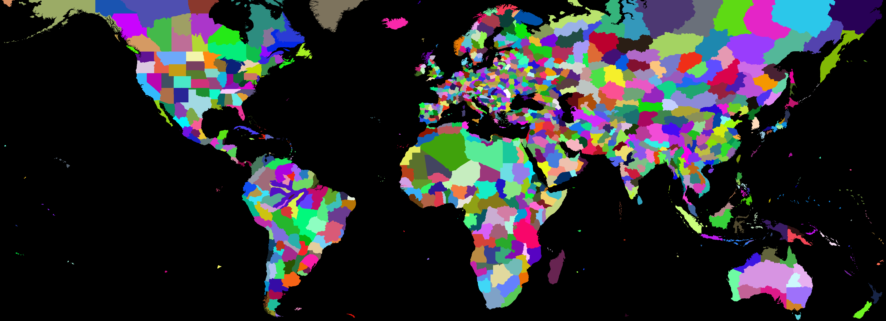
    - Регионы (сочетание клавиш: ALT+R) - отрисовка Strategic Regions
    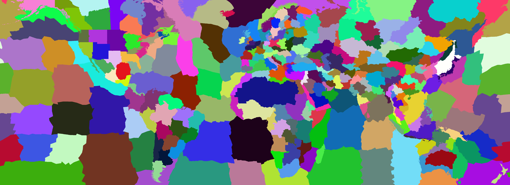
    - Зоны ИИ (сочетание клавиш: ALT+A) - отрисовка Ai Areas
    
    - Страны (сочетание клавиш: CTRL+ALT+C) - отрисовка контроля территорий странами
    
    - Национальные области - отрисовка национальных областей для выбранной страны (пример: Германия)
    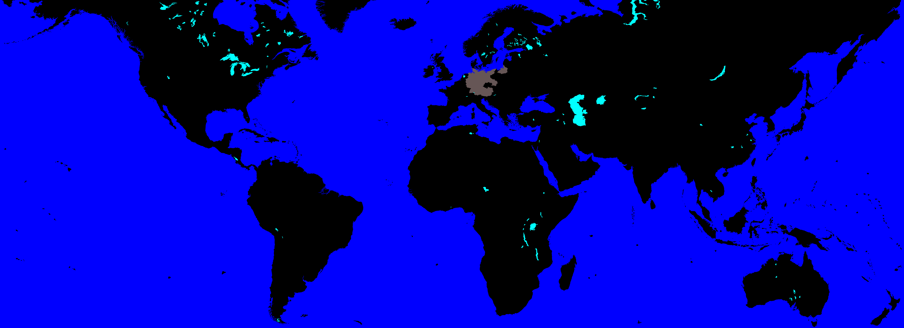
    - Претензии на области - отрисовка претензий на области для выбранной страны (пример: Германия)
    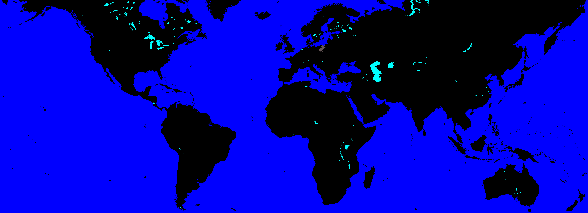
    - Типы провинций - отрисовка наземных, озёрных и морских провинций с учётом параметра их прибрежности из definition.csv
    
    - Местность провинций (сочетание клавиш: ALT+T) - отрисовка провинций по цвету их местности, указанной в definition.csv
    
    - Размер провинций - отрисовка провинций, где их цвет зависит от количества пикселей в данной провинции и вычисляется по логарифмической шкале от чёрного (минимальное количество пикселей) до белого (наибольшее количество пикселей)
    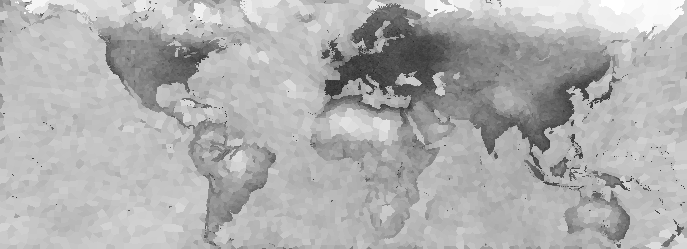
    - Местность регионов - отрисовка стратегических регионов, где их цвет зависит от значения параметра naval_terrain, указанного в файлах регионов, и цвета текущей морской местности региона
    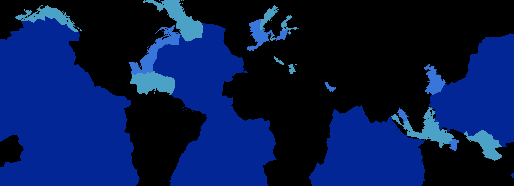
    - Континенты (сочетание клавиш: ALT+C) - отрисовка провинций, цвет которых зависит от номера континента, указанного для провинций в файле definition.csv
    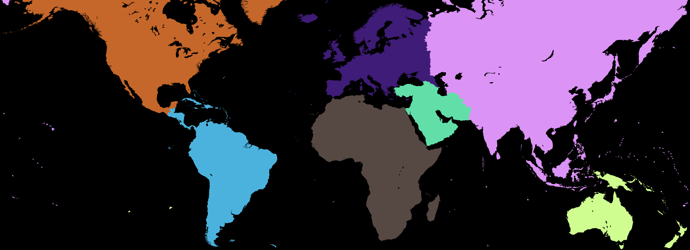
    - Население (сочетание клавиш: ALT+M) - отрисовка областей, где их цвет зависит от населения в областей и вычисляется по логарифмической шкале от чёрного (минимальное население среди всех областей) до белого (наибольшее население среди всех областей)
    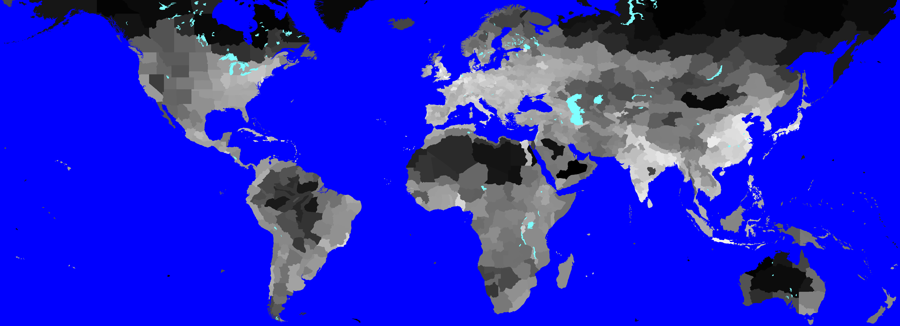
    - Очки победы (сочетание клавиш: ALT+V) - отрисовка провинций, где их цвет зависит от количества очков победы в провинции и вычисляется по логарифмической шкале от чёрного (минимальное население среди всех провинций) до белого (наибольшее население среди всех провинций)
    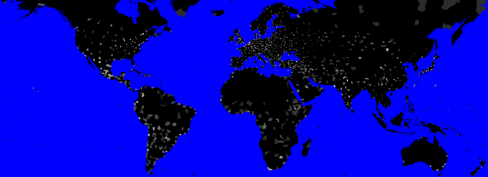
    - Категории областей - отрисовка областей, где их цвет зависит от указанных в State файлах значений State Category
    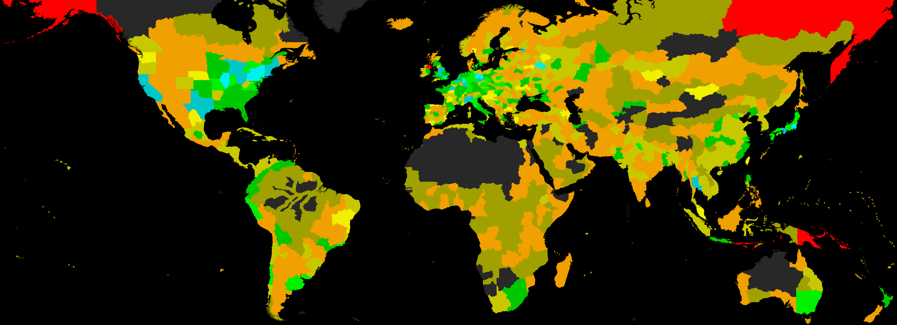
    - Постройки (сочетание клавиш: ALT+B) - отрисовка провинций или областей, цвет которых зависит от уровня построек в провинциях и областях. Целевая постройка выбирается пользователем в выпадающем списке "Параметр" при выбранном инструменте "Постройки"
    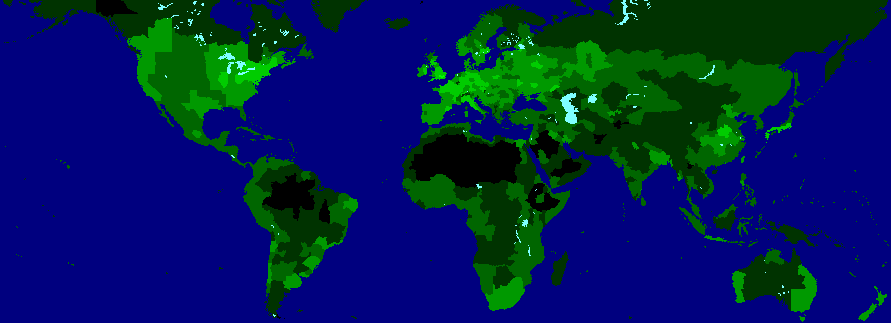
    - Карта местности - отрисовка карты в режиме карты местности (файл "terrain.bmp")
    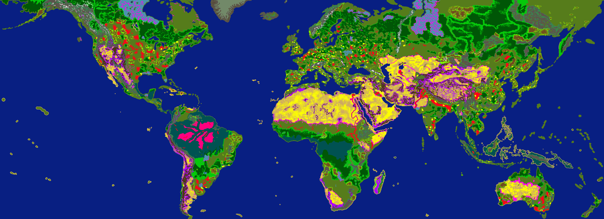
    - Карта деревьев - отрисовка карты в режиме карты деревьем (файл "trees.bmp")
    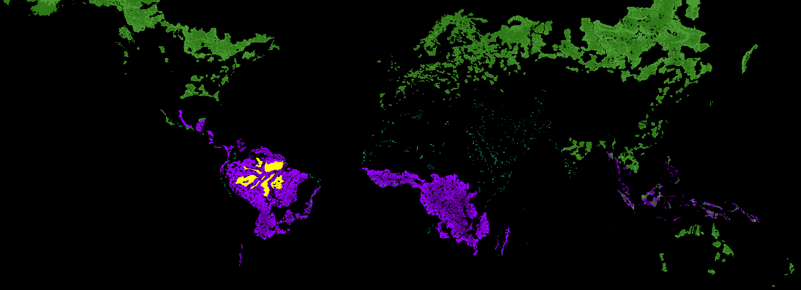
    - Карта городов - отрисовка карты в режиме карты городов (файл "cities.bmp")
    
    - Карта высот - отрисовка карты в режиме карты высот (файл "heightmap.bmp")
    
    - Карта нормалей - отрисовка карты в режиме карты нормалей (файл "world_normals.bmp")
    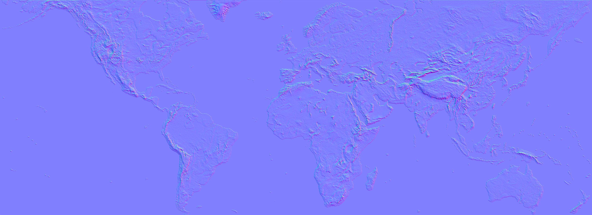
    - Кастомный скрипт - отрисовка карты по кастомному скрипту, написанному на встроенном в программу внутреннему скриптовом языке (см. подробнее в: [Скриптинг](/docs/scripting/lang=ru.md))
    
    - Нет - отрисовка карты полностью в белом цвете

    </details>
---
- [4] Параметр основного слоя - отображается только в том случае, если выбрано значение "Кастомный скрипт" в выпадающем списке "Основной слой" [3]. Позволяет выбрать кастомный скрипт (текстовый файл, оканчивающийся на ".mm.txt"), который используется для определения цвета пикселей на карте (см. подробнее в: [Скриптинг](/docs/scripting/lang=ru.md))
---
- [5] Рабочий слой - определяет текущий редактируемый слой карты в программе

    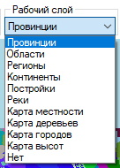

    <details>
    <summary><i>Подробнее</i></summary>
    
    Поддерживает выбор редактирования следующих слоёв:
    - Провинции
    - Области
    - Регионы
    - Континенты
    - Постройки
    - Реки
    - Карта местности
    - Карта деревьев
    - Карта городов
    - Карта высот
    - Нет

    Каждый инструмент содержит свой набор слоёв, на которых он может работать и вносить изменения (см. подробнее в: [Инструменты для работы с картой](/docs/tools/map/lang=ru.md))
    </details>
---
- [6] Инструмент - определяет активный инструмент для редактирования карты

    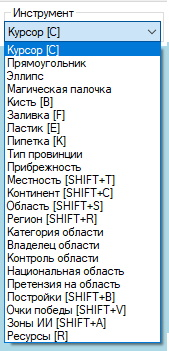

    <details>
    <summary><i>Подробнее</i></summary>

    Ниже приведено краткое описание доступных в программе инструментов. \
    Подробное описание и инструкция по работе с каждым инструментом приведены в статье: [Инструменты для работы с картой](/docs/tools/map/lang=ru.md)
    
    Поддерживает использование следующих инструментов:
    - Курсор **[C]** - позволяет взаимодействовать и выбирать объекты на карте  (см. подробнее в [Инструмент "Курсор"](/docs/tools/map/common/cursor/lang=ru.md))
  
    - Прямоугольник **(ВРЕМЕННО ОТКЛЮЧЕНО)** - позволяет выделять на картах прямоугольные зоны
  
    - Эллипс **(ВРЕМЕННО ОТКЛЮЧЕНО)** - позволяет выделять на картах элипсоидные зоны
  
    - Магическая палочка **(ВРЕМЕННО ОТКЛЮЧЕНО)** - позволяет выделять на картах зоны сложной формы по их цвету
  
    - Кисть **[B]** - позволяет рисовать на картах (см. подробнее в [Инструмент "Кисть"](/docs/tools/map/common/brush/lang=ru.md))
  
    - Заливка **[F]** - позволяет заливать зоны на картах выбранным цветом (см. подробнее в [Инструмент "Заливка"](/docs/tools/map/common/fill/lang=ru.md))
  
    - Ластик **[E]** - позволяет стирать на картах пиксели (или в некоторых случаях заливать их белым цветом) (см. подробнее в [Инструмент "Ластик"](/docs/tools/map/common/eraser/lang=ru.md))
  
    - Пипетка **[K]** - позволяет выбирать (копировать) цвет пикселей на карте (см. подробнее в [Инструмент "Пипетка"](/docs/tools/map/common/pipette/lang=ru.md))
  
    - Тип провинции - позволяет менять тип провинции (land, lake, sea) (см. подробнее в [Инструмент "Тип провинции"](/docs/tools/map/common/province_type/lang=ru.md))
  
    - Прибрежность - позволяет редактировать тип пребрежности провинций на карте (см. подробнее в [Инструмент "Прибрежность"](/docs/tools/map/common/province_coastal/lang=ru.md))
  
    - Местность **[SHIFT+T]** - позволяет редактировать местность провинций на карте (см. подробнее в [Инструмент "Местность"](/docs/tools/map/common/terrain/lang=ru.md))
  
    - Континент **[SHIFT+C]** - позволяет редактировать континент провинций на карте (см. подробнее в [Инструмент "Континент"](/docs/tools/map/common/province_continent/lang=ru.md))
  
    - Область **[SHIFT+S]** - позволяет редактировать принадлежность провинций к областям (states) на карте. При передаче провинции между областями в новый State передаются также её постройки, очки победы и другие данные (см. подробнее в [Инструмент "Область"](/docs/tools/map/common/province_state/lang=ru.md))
  
    - Регион **[SHIFT+R]** - позволяет редактировать регион (Strategic Region) провинций на карте (см. подробнее в [Инструмент "Регион"](/docs/tools/map/common/province_region/lang=ru.md))
  
    - Категория области - позволяет редактировать категорию области (state_category) у целевой области (State) на карте (см. подробнее в [Инструмент "Категория области"](/docs/tools/map/common/state_category/lang=ru.md))
  
    - Владелец области - позволяет редактировать страну-владельца (owner) у целевой области (State) на карте (см. подробнее в [Инструмент "Владелец области"](/docs/tools/map/common/state_owner/lang=ru.md))
  
    - Контроль области - позволяет редактировать страну, контролирующую (controller) целевую область (State) на карте (см. подробнее в [Инструмент "Контроль области"](/docs/tools/map/common/state_controller/lang=ru.md))
  
    - Национальная область - позволяет редактировать список национальных областей выбранной страны (см. подробнее в [Инструмент "Претензия на область"](/docs/tools/map/common/state_core_of/lang=ru.md))

    - Претензия на область - позволяет редактировать список претензий выбранной страны на области на карте (см. подробнее в [Инструмент "Претензия на область"](/docs/tools/map/common/state_claim_by/lang=ru.md))
  
    - Постройки **[SHIFT+B]** - позволяет редактировать уровень построек в целовой провинции или целевой области (State) на карте (зависит от типа выбранной постройки) (см. подробнее в [Инструмент "Постройки"](/docs/tools/map/common/buildings/lang=ru.md))
  
    - Очки победы **[SHIFT+V]** - позволяет редактировать количество очков победы в целевой провинции на карте (см. подробнее в [Инструмент "Очки победы"](/docs/tools/map/common/victory_points/lang=ru.md))

    - Зоны ИИ **[SHIFT+A]** - позволяет редактировать вхождение континентов или стратегических регионов в зоны ИИ (ai_areas) (см. подробнее в [Инструмент "Зоны ИИ"](/docs/tools/map/common/ai_area/lang=ru.md))
  
    - Ресурсы **[B]** - позволяет редактировать количество выбранного ресурса в указанной области на карте (см. подробнее в [Инструмент "Ресурсы"](/docs/tools/map/common/resources/lang=ru.md))

    </details>
---
- [7] Параметр - определяет активный параметр для активного инструмента. Отображается только в том случае, если инструмент требует параметр для работы
---
- [8] Значение - определяет значение выбранного параметра для активного инструмента. Отображается только в том случае, если инструмент требует параметр для работы, а параметр требует значение
---
- [9] Цвета - отображает основной (первый) и вторичный (второй) слоты для выбранных цветов. Нажатие ЛКМ на любой из слотов для цветов включает/выключает отображение окна выбора цвета.
  
    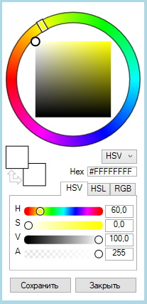
---
- [10] Генерация цвета - в выпадающем списке можно выбрать один из четырех режимов генерации. Сгенерировать новый цвет можно нажатием на кнопку "+". Нажатие ЛКМ вставит сгенерированный цвет в основной (первый) слот для цвета, а нажатие ПКМ - во вторичный (второй) слот.

    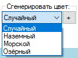

      Режимы генерации цветов:
      1. Случайный - генерируется полностью случайный цветЮ ранее не представленный на карте провинций
      2. Наземный - генерируется новый уникальный цвет из цветового пространства наземных провинций (не влияет на тип провинции в definition.csv), ранее не представленный на карте провинций
      3. Морской - генерируется новый уникальный цвет из цветового пространства морских провинций (не влияет на тип провинции в definition.csv), ранее не представленный на карте провинций
      4. Озёрный - генерируется новый уникальный цвет из цветового пространства озёрных провинций (не влияет на тип провинции в definition.csv), ранее не представленный на карте провинций
---
- [11] Палитра цветов - отображающий список цветов, доступных для быстрого выбора. Нажатие ЛКМ по цвету вставляет его в основной (первый) слот цвета для инструмента, а ПКМ - во вторичный (второй).
  
  Если выбран рабочий слой "Реки", то в палитре отображаются цвета из rivers.bmp карты, используемые для рисования рек.

    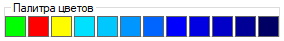
  
  Если выбран любой другой рабочий слой, то отображается история из последних выбранных цветов (не более 10).

    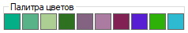
---
- [12] Прогресс-бар, отображающий текущий статус процесса загрузки или сохранения (или его результат) в формате: 

    ```
    <Статус>: [П: <количество предупреждений>; О: <Количество ошибок>; К: <количество критических ошибок>]
    ```

    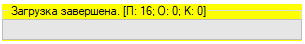

    В процессе загрузки данных, парсер может обнаружить некорректно заполненные участки файлов игры и/или мода. В случае возникновения каких-либо проблем, программа сообщит пользователю об этом, отобразив отдельное окно или несколько окон со списком обнаруженных проблем.

      Предупреждение - некорректное заполнение файла, которое не является критичным и не влияет на работу программы. Носит рекомендательный характер к исправлению.
      
      Ошибка - некорректное заполнение файла, которое может привести к потере данных при попытке выполнить сохранение информации через интерфейс программы. Не останавливает загрузку данных игры и мода, но запрещает выполнять сохранения через программу. Требует от пользователя, чтобы тот исправил найденные ошибки вручную в указанных файлах.
      
      Критическая ошибка - некорректное заполнение файла, которое приводит к преждевременной остановке загрузки данных игры и мода. Требует от пользователя исправление ошибки вручную в указанном файле.

    Пример окна со списком Предупреждений приведён ниже.

    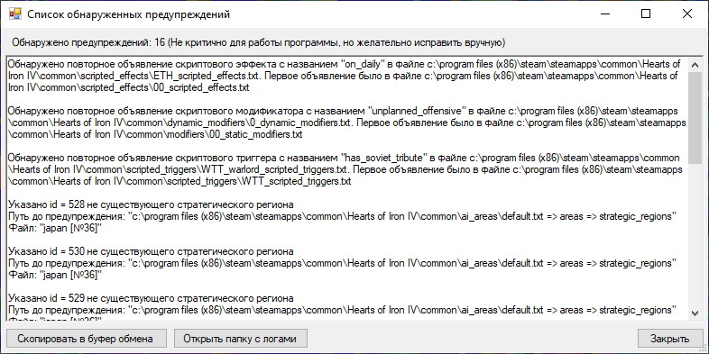

---
- [13] Дополнительные слои - текстурные карты или объекты, накладываемые поверх основного слоя карты.

  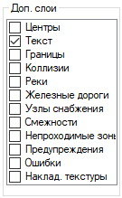
    
    <details>
    <summary><i>Подробнее</i></summary>

    Список дополнительных слоёв:
    - Центры - включает отображение центров провинций на карте
    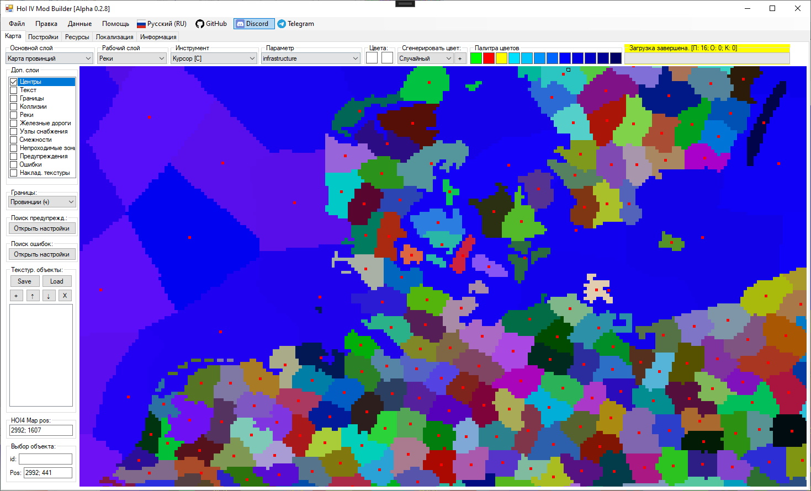
    - Текст - включает отображение текста на карте в зависимости от выбранного главного слоя, параметра и/или значения выбранного инструмента и т.д.
    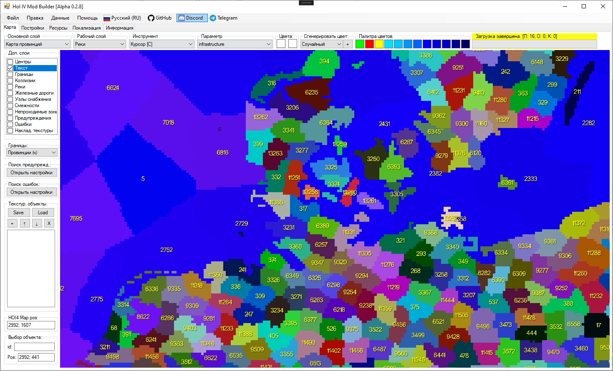 
    - Границы - включает отображение белых или чёрных границ провинций, областей или регионов (тип и цвет выбираются в выпадающем списке [14] "Границы")
    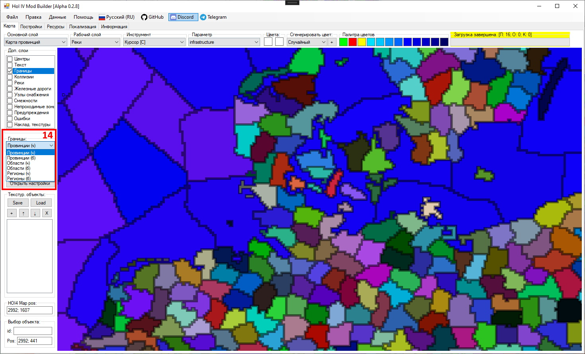
    
    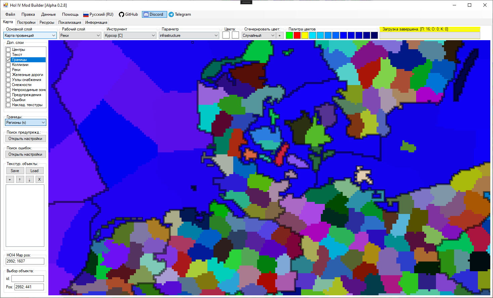
    - Реки - включает отображение рек поверх основного слоя. (Для редактирования рек, выберите рабочий слой "Реки" и инструмент "Кисть" или "Ластик" в выпадающем списке инструментов)
    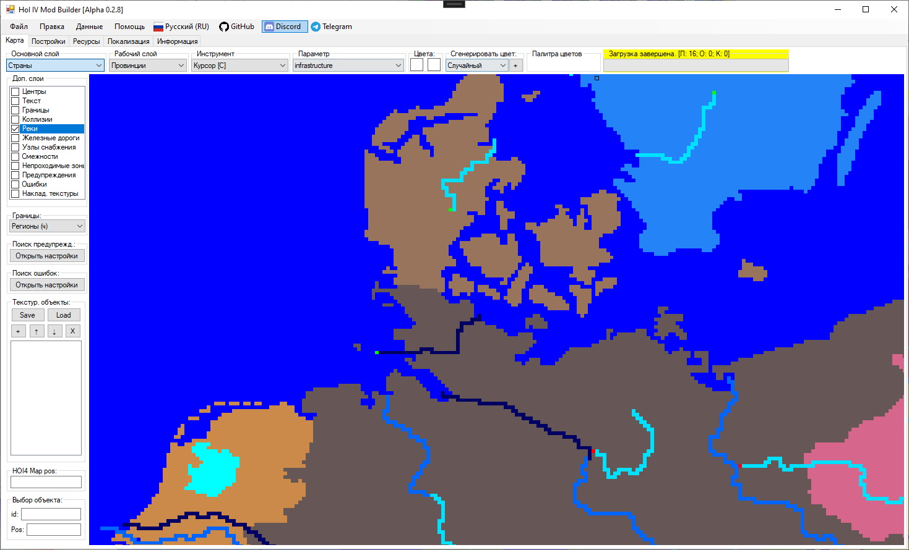
    - Железные дороги - включает отображение железных дорог поверх основного слоя (о создании, редактировании и удалении см. подробнее в: [Инструменты для работы с картой](/docs/tools/map/lang=ru.md)) 
    
    - Узлы снабжения - включает отображение узлов снабжения поверх основного слоя (о создании, редактировании и удалении см. подробнее в: [Инструменты для работы с картой](/docs/tools/map/lang=ru.md))
    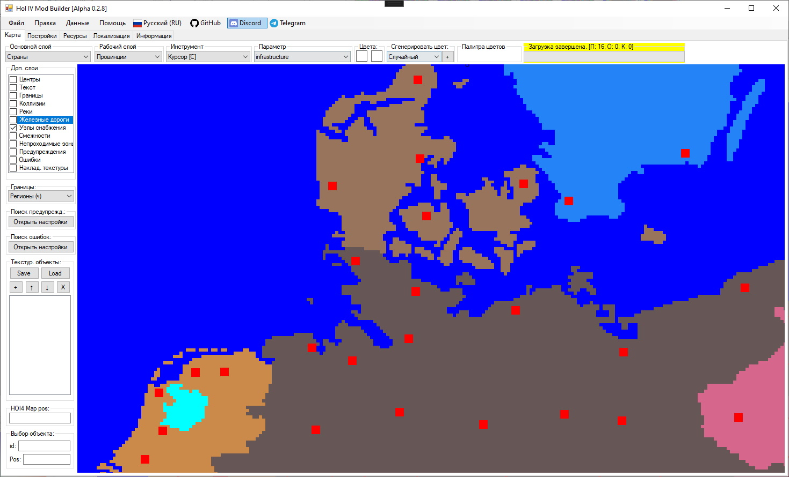
    - Смежности - включает отображение смежностей между провинциями из файла adjacencies.csv (о создании, редактировании и удалении см. подробнее в: [Инструменты для работы с картой](/docs/tools/map/lang=ru.md))
    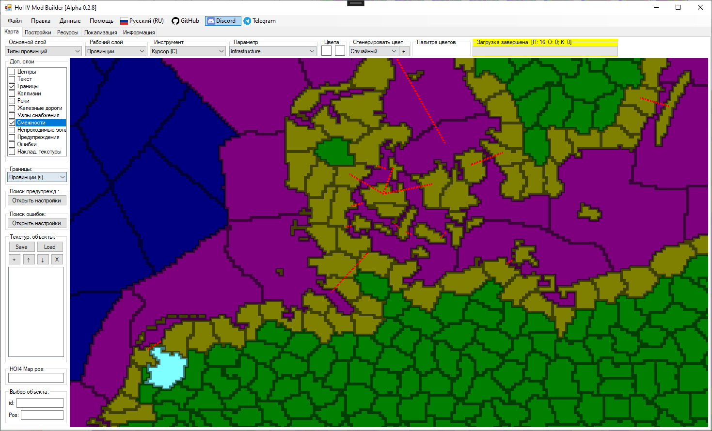
    - Непроходимые зоны - временно отключено и не работает
    - Предупреждения - включает отображение связанных с картой предупреждений, которые не являются критичными, но на них следует обратить внимание (см. подробнее в: [Поиск предупреждений и ошибок на карте](/docs/warnings_and_errors_search/lang=ru.md))
    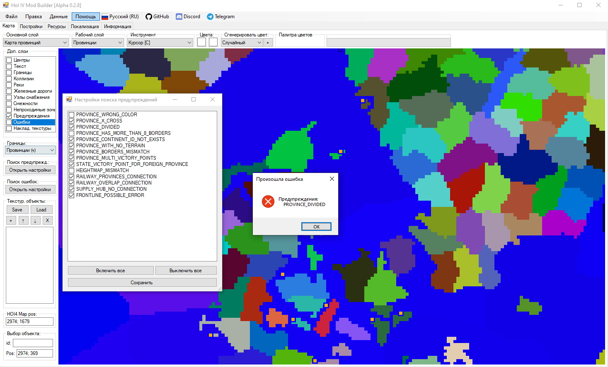
    - Ошибки - включает отображение важных и/или критических связанных с игровой картой ошибок, которые в том числе могут приводить к крашу игры (см. подробнее в: [Поиск предупреждений и ошибок на карте](/docs/warnings_and_errors_search/lang=ru.md))
    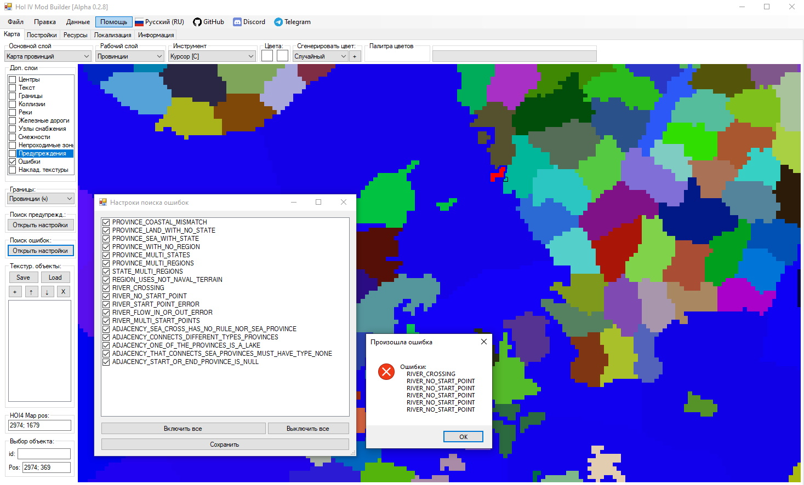
    - Накладываемые текстуры - включает отображение накладываемых поверх игровой карты дополнительных пользовательских текстур. Пример использования: наложение реальных карт, на основе которых можно создавать и редактировать игровую карту (см. подробнее в: [Накладываемые текстурные объекты]())
    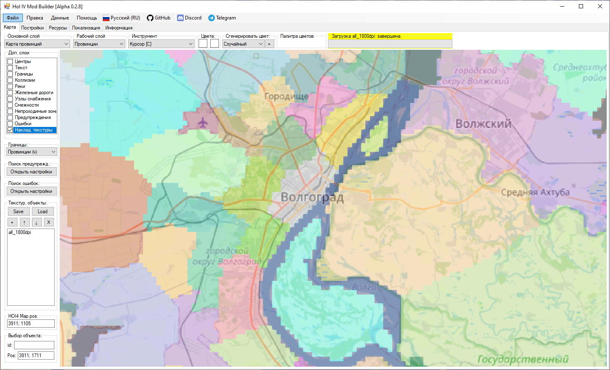

    </details>

---
- [14] Границы - позволяет настроить цвет (белый и черный) отображения границ на карте (границы провинций, областей и регионов)

  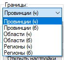
  
---
- [15] Настройки поиска предупреждений - позволяет выбрать список предупреждений, связанных с картой, которые программе необходимо найти и вывести при загрузке или обновлении данных мода (см. подробнее в: [Поиск предупреждений и ошибок на карте](/docs/warnings_and_errors_search/lang=ru.md))
  
  Отображение предупреждений на карте включается соответствующим пунктом в [13] "Доп. слои" 

  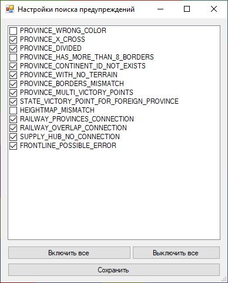

---
- [16] Настройки поиска ошибок - позволяет выбрать список важных и критических ошибок, связанных с картой, которые программе необходимо найти и вывести при загрузке или обновлении данных мода (см. подробнее в: [Поиск предупреждений и ошибок на карте](/docs/warnings_and_errors_search/lang=ru.md))
  
  Отображение ошибок на карте включается соответствующим пунктом в [13] "Доп. слои" 

  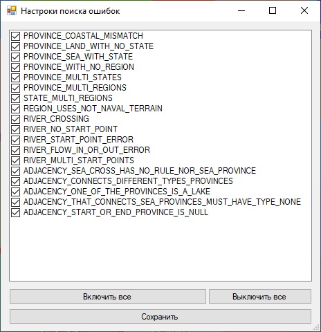

---
- [17] Текстурные объекты - позволяет загружать, настраивать порядок, удалять, сохранять и загружать группы пресетов текстурных объектов поверх основной карты.
  
  Пример использования: наложение реальных карт, на основе которых можно создавать и редактировать игровую карту (см. подробнее в: [Накладываемые текстурные объекты]())

  

---
- [18] Позиция выбранной точки на карте в системе кординат игры (точка отсчёта координат находится в левом нижнем углу карты, ось Y направлена вверх)

  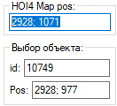

---
- [19] ID выбранных объектов (провинций, областей или регионов) на карте. Тип выбираемого объекта зависит от текущего выбранного [5] Рабочего слоя (если выбрано значение "Провинции", то выбираются провинции на карте, если "Области" - то области, "Регионы" - то регионы).
  
  Если зажать SHIFT и нажимать ЛКМ на объекты на карте, они будут добавляться в группу выбранных объектов (или удаляться при повторном нажатии). ID выбранных объектов на карте записывается в строку с пробелом в виде символа-разделителя

  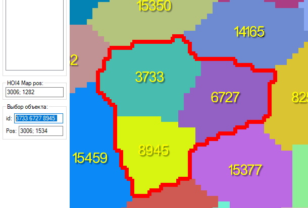
  
---
- [20] Позиция выбранной точки на карте в системе кординат программы/графических редакторов (точка отсчёта координат находится в левом верхнем углу карты, ось Y направлена вниз)

  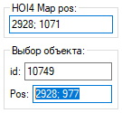

---
- [21] Окно отображения карты мода - отображает карту мода и связанные с ней объекты

  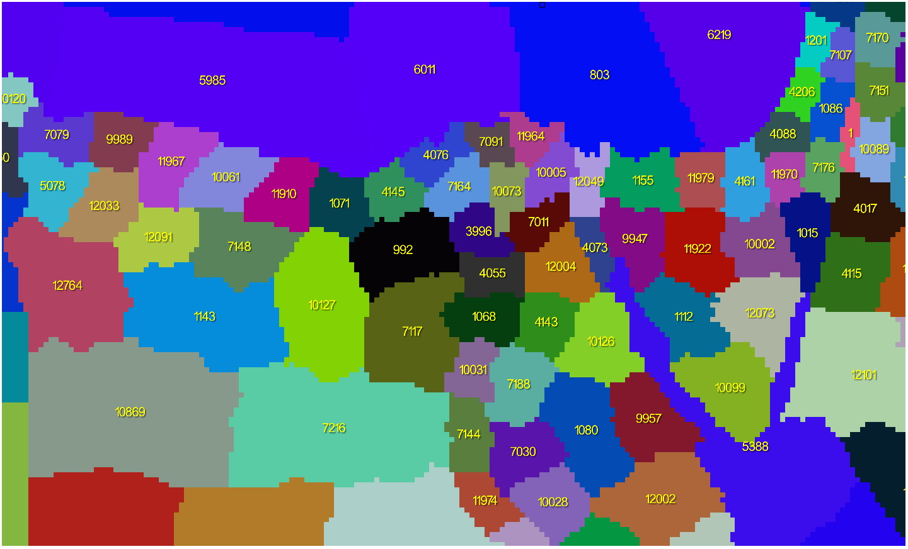
