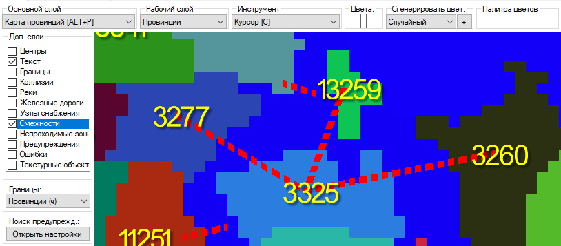

# [🠈](../../lang=ru.md) | Инструмент "Смежности"

Инструмент "Железные дороги", доступный через пункт контекстного меню или по сочетаниям горячих клавиш, позволяет создавать, редактировать и удалять смежности (adjacencies) между провинциями.

Чтобы увидеть смежности на карте, включите в "Доп. слои" отображение смежностей.

Для создании смежности, выберите первую провинцию нажатием ЛКМ по карте, потом выберите вторую провинцию нажатием ПКМ. В открывшемся контекстном меню выберите пункт "Смежность" и "Создать межность".

В результате на карте будет создана смежность.

Чтобы редактировать смежность на карте, выберите её нажатием ЛКМ (выбранная смежность изменит свой цвет с красного на синий), а затем нажмите ПКМ и откройте в контекстном меню пункт "Смежность".

Теперь вы можете поменять:
1. Тип смежности (NONE, SEA, LAKE, IMPASSIBLE)
2. Удалить смежность
3. Установить первую провинцию в смежности (кнопка) - первой провинцией будет установлена та провинция, по которой вы ранее нажали ПКМ и границы которой отображаются на карте оранжевым цветом (текущая первая провинция отмечается красным квадратом на карте)
4. Установить первую провинцию в смежности по ID (текстовое поле)
5. Установить первую точку смежности (кнопка) - по умолчанию точка находится в центре первой провинции смежности (провинции с красной точкой) и игра самостоятельно выбирает точку на карте по внутреннему алгоритму. Нажав на данную кнопку, вы можете задать конкретную точку на карте, из которой визуально в игре будет выходить первый конец смежности
6. Установить первую точку смежности по координатам (текстовое поле) - координаты указываются в формате "x; y"
7. Установить вторую провинцию в смежности (кнопка) - второй провинцией будет установлена та провинция, по которой вы ранее нажали ПКМ и границы которой отображаются на карте оранжевым цветом (текущая вторая провинция отмечается синим квадратом на карте)
8. Сбросить первую точку - позволяет сбросить указанные координаты точки первого конца смежности до "-1; -1", чтобы смежность использовала координаты центра первой провинции 
9. Установить вторую провинцию в смежности по ID (текстовое поле)
10. Установить вторую точку смежности (кнопка) - по умолчанию точка находится в центре второй провинции смежности (провинции с синей точкой) и игра самостоятельно выбирает точку на карте по внутреннему алгоритму. Нажав на данную кнопку, вы можете задать конкретную точку на карте, из которой визуально в игре будет выходить второй конец смежности
11. Установить вторую точку смежности по координатам (текстовое поле) - координаты указываются в формате "x; y"
12. Сбросить вторую точку- позволяет сбросить указанные координаты точки второго конца смежности до "-1; -1", чтобы смежность использовала координаты центра второй провинции
13. Установить среднюю провинцию (кнопка) - средней провинцией будет установлена та провинция, по которой вы ранее нажали ПКМ и границы которой отображаются на карте оранжевым цветом (текущая вторая провинция отмечается зелёным квадратом на карте). Средняя провинция используется для смежностей, соединяющих через воду два участка суши, переход по которым для юнитов может быть заблокирован вражеским флотом
14. Установить среднюю провинцию по ID (текстовое поле)
15. Выбор правила для смежности (adjacency_rule) - позволяет указать, какое правило будет использоваться смежностью
16. Добавить требуемую провинцию - позволяет добавить в список требуемых провинций (required_provinces) у выбранного правила смежности(adjacency_rule) провинцию, по которой вы ранее нажали ПКМ и границы которые которой отображаются на карте голубым цветом
17. Удалить требуемую провинция - позволяет удалить из списока требуемых провинций (required_provinces) у выбранного правила смежности(adjacency_rule) провинцию, по которой вы ранее нажали ПКМ и границы которые которой отображаются на карте голубым цветом
18. Поле для комментария к выбранной смежности

