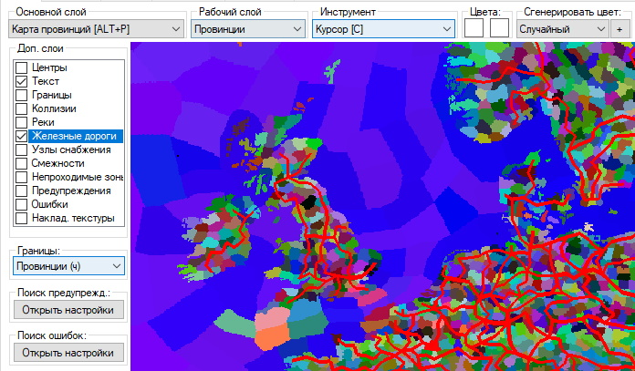
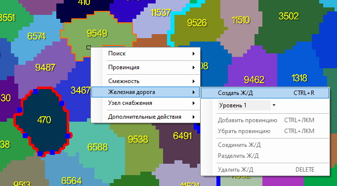
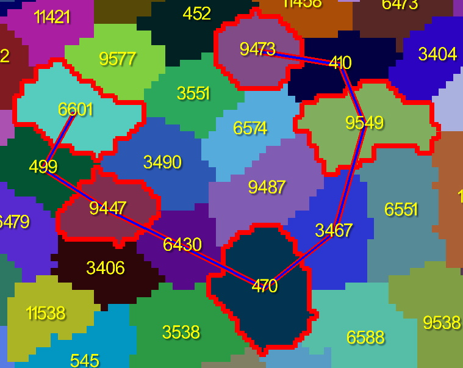
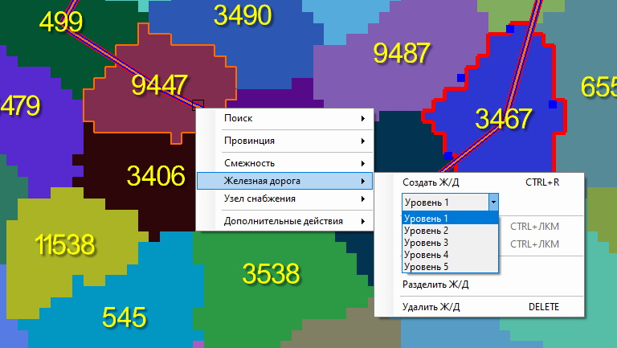
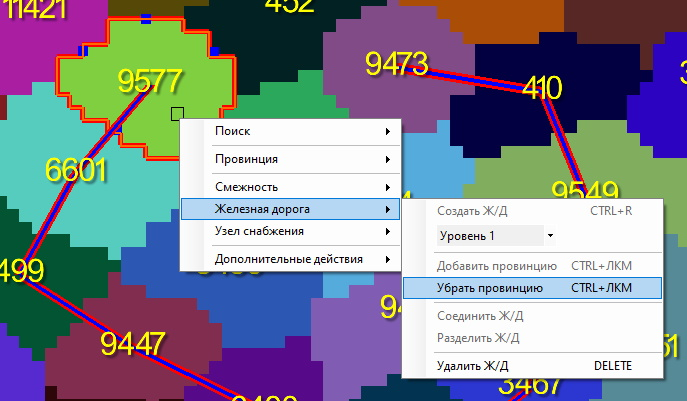
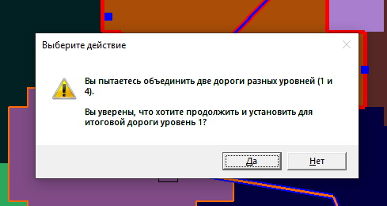
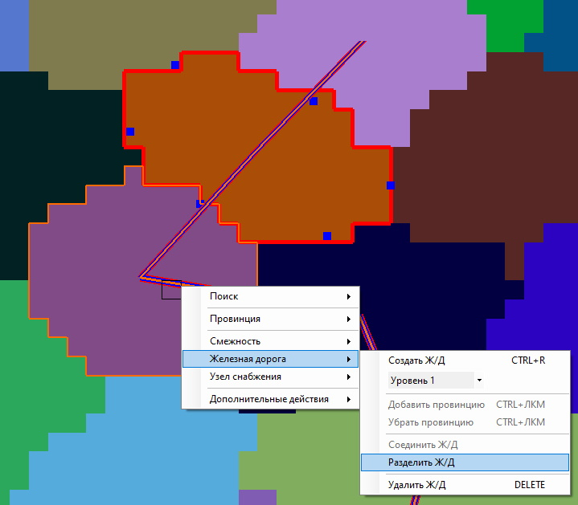
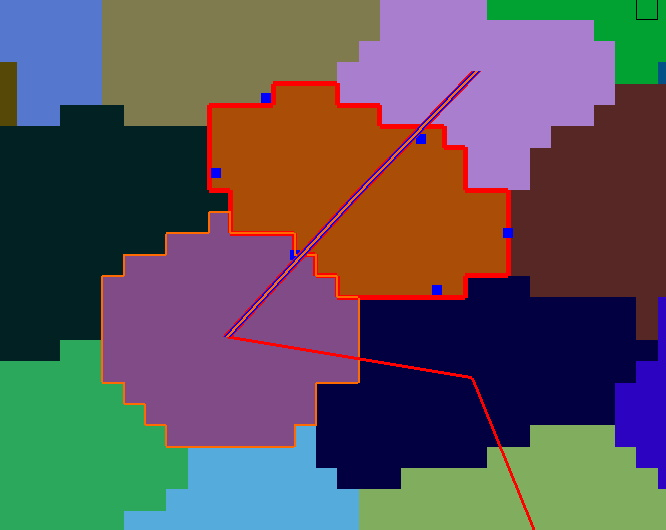
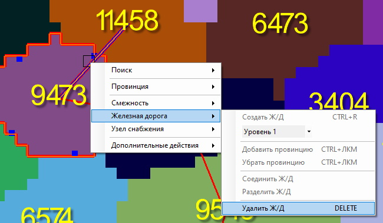

# [🠈](../../lang=ru.md) | Инструмент "Железные дороги"

Инструмент "Железные дороги", доступный через пункт контекстного меню или по сочетаниям горячих клавиш, позволяет:
1. Создавать железные дороги;
2. Редактировать их уровень и входящие в них провинции;
3. Разделять железные дороги на более короткие независимые участки;
4. Соединять две отдельные железные дороги в одну неприрывную дорогу;
5. Удалять железные дороги с карты. 

    
Чтобы увидеть железные дороги на карте, не забудьте включить их отображение в "Доп. слои".

## Создание железной дороги
Создать железную дорогу можно двумя способами (в обоих способах используется алгоритм A* для поиска кратчайшего пути между выбранными провинциями):
1. Выберите первую провинцию нажатием **[ЛКМ]** по карте, потом выберите вторую провинцию нажатием **[ПКМ]**. В открывшемся контекстном меню выберите пункт "Железная дорога" и "Создать Ж/Д"; \

2. Зажмите SHIFT и нажимайте ЛКМ на провинции в том порядке, в котором их необходимо соединить железной дорогой. Затем нажмите **[CTRL+R]**, чтобы создать железную дорогу. \

## Выбор железной дороги
Чтобы выбрать железную дорогу на карте, нажмите на неё **[ЛКМ]**. При выборе цвет железной дороге изменится с красного на синий.

## Изменение уровня
Изменить уровень выбранной железной дороги можно двумя способами:
1. Через контекстное меню; \

2. Через нажатие **[CTRL+1/2/3/4/5]**, где цифра в сочетании клавишь отвечает за устанавливаемый уровень железной дороги.

## Добавление провинции
Добавить новую провинцию в железную дорогу можно двумя способами:
1. Через контекстное меню и пункт "Добавить провинцию" после нажатия **[ПКМ]** по провинции, прилегающей к одному из концов железной дороги; \

2. Нажав **[CTRL+ЛКМ]** по провинции, прилегающей к одному из концов железной дороги.

## Удаление провизции
Удалить провинцию из железной дороги можно двумя способами:
1. Через контекстное меню и пункт "Удалить провинцию" после нажатия **[ПКМ]** по провинции, прилегающей к одному из концов железной дороги; \

2. Нажав **[CTRL+ЛКМ]** по провинции, прилегающей к одному из концов железной дороги.

## Соединение железных дорог
Программа позволяет объединять две железные дороги в одну, если конец одной железной дороги находится в той же или соседней провинции, что и конец второй железной дороги.

Чтобы соединить две железные дороги в одну, необходимо сначала нажать **[ЛКМ]** по первой железной дороге (выбрать основную ж/д), потом нажать ПКМ по второй железной дороге (выбрать присоединяемую ж/д), а затем в контекстном меню выбрать пункты "Железная дорога" и "Соединить Ж/Д".

Обратите внимание, что уровень получившейся после объединения железной дороги будет равняться уровню той железной дороги, которую вы выбрали нажатием **[ЛКМ]**. Если уровни выбранных железных дорог отличаются, будет отображено соответствующее уведомление с подтверждением того, что вы хотите сделать.

## Разделение железной дороги
Чтобы разделить одну железную дорогу на два независимых участка, необходимо сначала нажать **[ЛКМ]** по целевой железной дороге (выбрать её на карте), затем нажать **[ПКМ]** по провинции, в которой вы хотите разделить данную железную дорогу, а потом нажать на пункты контекстного меню "Железная дорога" и "Разделить Ж/Д".

Учтите, что вы можете разделить железную дорогу только в тех провинциях, через которые она проходит и в которых НЕ находится её конец.

## Удаление железной дороги
Удалить выбранную на карте железную дорогу можно двумя способами:
1. Открыть контекстное меню и выбрать пункты "Железная дорога" и "Удалить Ж/Д"; \

2. Нажать кнопку **[Delete]**