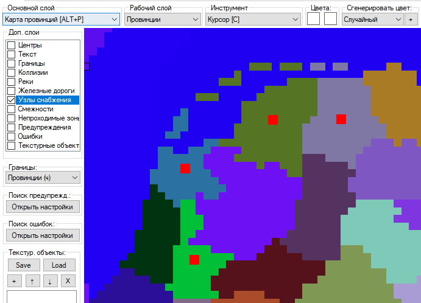
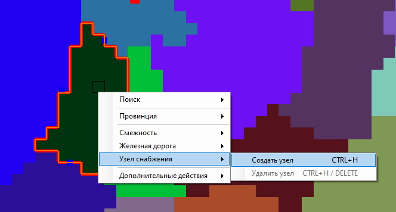

# [🠈](../../lang=ru.md) | Инструмент "Узлы снабжения"

Инструмент "Железные дороги", доступный через пункт контекстного меню или по сочетаниям горячих клавиш, позволяет:
1. Создавать узлы снабжения в провинциях;
2. Удалять узлы снабжения в провинциях.

---

Сочетание горячих клавиш: \
**[CTRL+H]** - создать/удалить узел снабжения в выбранной провинции. \
**[Delete]** - удалить выбранный узел снабжения.

Используемые параметры: **Отсутствуют** \
Разрешённые рабочие слои: **Провинции**

---

Чтобы увидеть узлы снабжения на карте, необходимо включить их отображение в "Доп. слои".

Создание и удаление узлов снабжение доступно двумя способами:
1. Через контекстное меню провинции в пункте "Узел снабжения";

    

2. Через сочетание клавиш **[CTRL+H]** в выбранной провинции на карте.
3. Через выделение узла снабжения на карте нажатием **[ЛКМ]** и клавиши **[Delete]**

