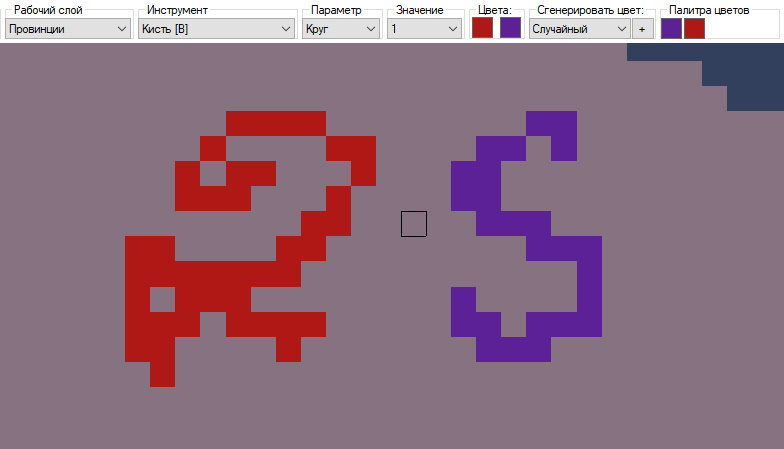
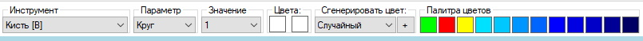
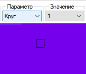
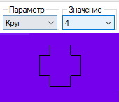
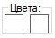
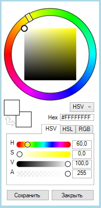
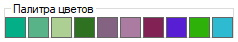

# [🠈](../../lang=ru.md) | Инструмент "Кисть"

Инструмент позволяет закрашивать пиксели на текстурных картах мода указанными цветами.

Сочетание горячих клавиш: **[B]** \
Используемые параметры: **Шаблон кисти; Значение кисти** \
Разрешённые рабочие слои: **Провинции; Реки; Карта местности; Карта деревьев; Карта городов; Карта высот**

# Описание работы с инструментом

При нажатии **[ЛКМ]** пиксель(-и) на карте окрашиваются в основной цвет, а при нажатии **[ПКМ]** - во вторичный цвет.

## Связанные с инструментом элементы топбара

#### Краткое описание элементов:
1. **Параметр** - позволяет выбрасть шаблон кисти

2. **Значение** - позволяет выбрать вариант шаблона кисти

3. **Цвета** - слоты активных цветов (основного и второстепенного). При нажатии показывает/скрывает интерфейс выбора цвета

4. **Сгенерировать цвет** - позволяет сгенерировать новый случайный цвет по указанному алгоритму (случайный, наземный, озёрный, морской)

5. **Палитра цветов** - отображает либо цвета из палитры карты рек ("rivers.bmp"), если выбран рабочий слой "Реки", либо историю из 10 последних использованных цветов, если выбран любой другой рабочий слой

## Шаблоны кисти и варианты шаблонов

По умолчанию в программе на данный момент доступен только один шаблон кисти - круг со 100 вариациями.

Изменение варианта используемого шаблона кисти (в данном случае - размера кисти) осуществляется двумя способами:
1. Выбор варианта кисти курсором через выпадающий список **Значение**
2. Через сочение **Вращение колеса мыши** с зажатой клавишей **[SHIFT]** (вращение вверх - увеличение размера кисти, вниз - уменьшение размера)

Подробнее о создании кастомных шаблонов и вариантов кистей см. в статье [Кастомизация кистей](/docs/customization/brushes/lang=ru.md)

## Основной и вторичный цвета

Элемент отображает основной (первый) и вторичный (второй) слоты для выбранных цветов. 

Нажатие **[ЛКМ]** на любой из слотов для цветов включает/выключает отображение окна выбора цвета.
  

## Генерация цвета

В выпадающем списке элемента можно выбрать один из четырех режимов генерации. Сгенерировать новый цвет можно нажатием на кнопку "+". Нажатие **[ЛКМ]** вставит сгенерированный цвет в основной (первый) слот для цвета, а нажатие **[ПКМ]** - во вторичный (второй) слот.

    Режимы генерации цветов:
    1. Случайный - генерируется полностью случайный цветЮ ранее не представленный на карте провинций
    2. Наземный - генерируется новый уникальный цвет из цветового пространства наземных провинций (не влияет на тип провинции в definition.csv), ранее не представленный на карте провинций
    3. Морской - генерируется новый уникальный цвет из цветового пространства морских провинций (не влияет на тип провинции в definition.csv), ранее не представленный на карте провинций
    4. Озёрный - генерируется новый уникальный цвет из цветового пространства озёрных провинций (не влияет на тип провинции в definition.csv), ранее не представленный на карте провинций

## Палитра цветов

Элемент отображает список цветов, доступных для быстрого выбора. Нажатие **[ЛКМ]** по цвету вставляет его в основной (первый) слот цвета для инструмента, а **[ПКМ]** - во вторичный (второй).
  
  Если выбран рабочий слой "Реки", то в палитре отображаются цвета из rivers.bmp карты, используемые для рисования рек.

  
  Если выбран любой другой рабочий слой, то отображается история из последних выбранных цветов (не более 10).

