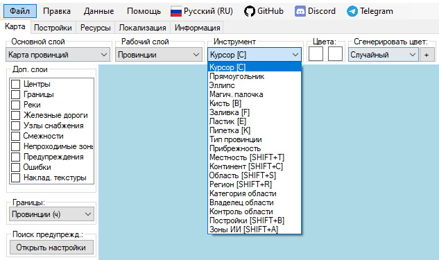
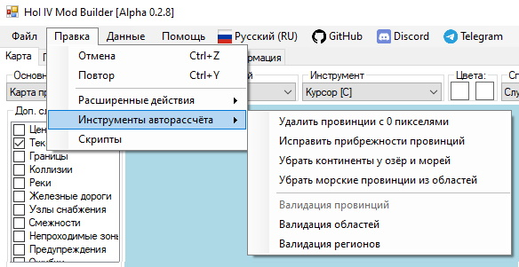

# [🠈](../lang=ru.md) | Инструменты для работы с Картой

### Для просмотра сценариев использования инструмента и его подробного описания нажмите на название инструмента в списке.

## Базовые инструменты

Базовые инструменты позволяют выполнять простые действия на карте мода. Выбрать активный инструмент можно через соответствующий выпадающий список или через нажатие соответствующей горячей клавиши или их сочетания. 

Если использование инструмента подразумевает настройку параметров, соответствующие выпадающие списки будут также отображены рядом с выпадающим списком выбора активного инструмента.

Список базовых инструментов:

1. [Курсор](common/cursor/lang=ru.md) **[C]** - позволяет выбирать объекты на карте;
2. [Прямоугольник](common/rectangle/lang=ru.md) - временно отключен;
3. [Эллипс](common/ellipse/lang=ru.md) - временно отключен;
4. [Магическая палочка](common/magic_wand/lang=ru.md) - временно отключен;
5. [Кисть](common/brush/lang=ru.md) **[B]** - позволяет рисовать на текстурных картах выбранным цветом;
6. [Заливка](common/fill/lang=ru.md) **[F]** - позволяет заливать область на текстурных картах выбранным цветом;
7. [Ластик](common/eraser/lang=ru.md) **[E]** - позволяет стрирать цвет пикселей на текстурных картах;
8. [Пипетка](common/pipette/lang=ru.md) **[K]** - позволяет копировать цвет из целевого пикселя на текстурных картах;
9. [Тип провинции](common/province_type/lang=ru.md) - позволяет изменять тип провинций (land, sea, lake) на карте;
10. [Прибрежность](common/province_coastal/lang=ru.md) - позволяет изменять прибрежность (isCoastal) провинций на карте;
11. [Местность](common/terrain/lang=ru.md) **[SHIFT+T]** - позволяет изменять местность провинций (terrain) на карте;
12. [Континент](common/province_continent/lang=ru.md) **[SHIFT+C]** - позволяет изменять континент (continent) провинций на карте;
13. [Область](common/province_state/lang=ru.md) **[SHIFT+S]** - позволяет редактировать принадлежность провинций на карте к областям (states);
14. [Регион](common/province_region/lang=ru.md) **[SHIFT+R]** - позволяет редактировать принадлежность провинций на карте к регионам (strategic regions);
15. [Категория области](common/state_category/lang=ru.md) - позволяет редактировать категории областей (states) на карте;
16. [Владелец области](common/state_owner/lang=ru.md) - позволяет редактировать странцу-владельца (owner) областей (states) на карте;
17. [Контроль области](common/state_controller/lang=ru.md) - позволяет редактировать страну-контроллера (controller) областей (states) на карте;
18. [Национальная область](common/state_core_of/lang=ru.md) - позволяет редактировать национальные области стран на карте;
19. [Претензия на область](common/state_claim_by/lang=ru.md) - позволяет редактировать претензии стран на области на карте;
20. [Постройки](common/buildings/lang=ru.md) **[SHIFT+B]** - позволяет редактировать количество построек (buildings) в провинциях и областях (states) на карте;
21. [Очки победы](common/victory_points/lang=ru.md) **[SHIFT+V]** - позволяет редактировать количество очков в указанной провинции;
22. [Зоны ИИ](common/ai_area/lang=ru.md) **[SHIFT+A]** - позволяет редактировать границы зон ИИ (ai areas) на карте;
23. [Ресурсы](common/resources/lang=ru.md) **[R]** - позволяет редактировать количество выбранного ресурса в указанной области (state).

## Расширенные инструменты

Расширенные инструменты позволяют выполнять широкий список более сложных действий с данными и объектами мода, вызов которых может осуществляться как через интерфейс программы, включая контекстное меню, так и путём нажатия горячих клавиш и их сочетаний. 

Подробнее о всех возможные действиях смотрите в статьях, связанных с перечисленными далее инструментами:

1. [Смежности](advanced/adjacencies/lang=ru.md) - позволяет создавать, изменять и удалять смежности между провинциями на карте;
2. [Железные дороги](advanced/railways/lang=ru.md) - позволяет создавать, изменять, разделять, соединять и удалять железные дороги на карте;
3. [Узлы снабжения](advanced/supply_hubs/lang=ru.md) - позволяет создавать и удалять узлы снабжения на карте;
4. [Объединение провинций](advanced/merge_provinces/lang=ru.md) - позволяет быстро объединять провинции на карте, уменьшая их общее количество;
5. [Поиск изменений на карте](advanced/find_map_changes/lang=ru.md) - позволяет находить все изменения, внесённые на карту провинций (перерисованные границы и изменённые id провинций), относительно выбранной предыдущей версии данных мода.

## Инструменты авторассчёта

Инструменты авторассчёта позволяют одним нажатием курсора выполнить действие или последовательность действий, которые практически мгновенно могут:
- Найти и исправить причины некоторых крашей игры;
- Исправить множественные ошибки и недочёты при заполнении некоторых файлов мода.
- Автоматически рассчитать и заполнить некоторые данные.
- Выполнить другую монотонную и сложную работу, которую в противном случае пришлось бы выполнять вручную.

Доступ к списку инструментов авторассчёта осуществляется через меню программы "Правка" и "Инструменты авторассчёта":

#### Список и описание инструментов авторассчёта:

1. **Удалить провинции с 0 пикселями:**
   
   - **Важность:** критическая, исправляет краш игры при запуске;   
   - **Описание:** удаляет из definition.csv объявление провинций, если их нет на карте (занято 0 пикселей). Освобождаемые ID от удаляемых провинций передаются другим провинциям на карте, чтобы уменьшить их общее количество в моде;

2. **Исправить прибрежности провинций:**
   
   - **Важность:** высокая, исправляет возможные краши игры из-за построек;
   - **Описание:** исправляет ошибки, связанные с несоответствием значения прибрежности (isCoastal) у провинций на карте (например, наземные провинции, соседствующие с морскими провинциями, но у которых значение прибрежности установлено на false);

3. **Убрать континенты у озёр и морей:**
   
   - **Важность: низкая;**
   - **Описание:** устанавливает значение континента на 0 у морских и озёрных провинций, поскольку их принадлежность к континентам не имеет смысла в рамках игры;

4. **Убрать морские провинции из областей:**
   
   - **Важность:** критическая, исправляет краш игры при запуске;
   - **Описание:** убирает все морские провинции из областей (states);
  
5. **Валидация провинций** - временно отключено;
6. **Валидация областей:**
   
   - **Важность:** высокая/критическая;
   - **Описание:** для каждой области (state) выполняет следующие действия:
   1. Сортирует провинции в области по увеличению ID;
   2. Удаляет повторные записи ID провинции в области;
   3. Удаляет провинцию из области, если она уже приписана к другой области (исправляет краш при запуске игры);
   4. Переносит очки победы (victory points) в другую (правильную) область, если в файле текущей области очки победы прописаны для провинции, которая относится к другой области. 
   
7. **Валидация регионов:**
   - **Важность:** высокая/критическая;
   - **Описание:** для каждого региона (strategic region) выполняет следующие действия:
   1. Сортирует провинции в регионе по увеличению ID;
   2. Удаляет повторные записи ID провинции в регионе;
   3. Удаляет провинцию из региона, если она уже приписана к другому региону.
