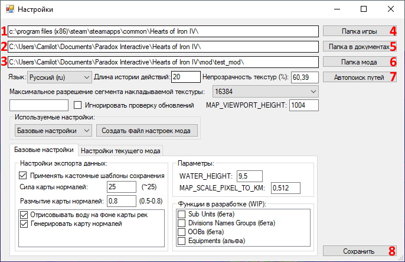

# Начало работы

<!-- NAV-START -->
<!-- NAV-END -->

<!-- OTHER-LANGS-START -->
<!-- OTHER-LANGS-END -->

Для начала работы в HOI4 Mod Builder вам необходимо открыть настройки программы и указать необходимые пути до основных папок игры и мода.

В меню программы нажмите на пункт "Файл", а затем кликните на кнопку "Настройки".


В открывшемся окне вам необходимо указать следующие пути: 
- [1] Путь до основной папки игры, в которой расположен файл "hoi4.exe"
- [2] Путь до папки игры в Документах 
- [3] Путь до папки мода 

Указать пути можно либо вручную, скопировав их из Проводника, либо нажать соответствующие кнопки [4, 5, 6] и выбрав требуемые папки через отдельное окно выбора.

Указав пути, нажмите на кнопку [7] Сохранить и, если пути до папок были указаны верно и программа не сообщила об ошибках, закройте окно "Настройки".

#### Подробнее о других пунктах настроек можно узнать [здесь]()



Следующим шагом необходимо вновь открыть пункт меню "Файл" и нажать на кнопку "Загрузить всё".


В правом верхнем углу программы распологается [1] прогресс-бар, отображающий текущий статус процесса загрузки или сохранения (или его результат) в формате: 

```
<Статус>: [П: <количество предупреждений>; О: <Количество ошибок>; К: <количество критических ошибок>]
```


В процессе загрузки данных, парсер может обнаружить некорректно заполненные участки файлов игры и/или мода. В случае возникновения каких-либо проблем, программа сообщит пользователю об этом, отобразив отдельное окно или несколько окон со списком обнаруженных проблем.

* **Предупреждение** - некорректное заполнение файла, которое не является критичным и не влияет на работу программы. Носит рекомендательный характер к исправлению.
  
* **Ошибка** - некорректное заполнение файла, которое может привести к потере данных при попытке выполнить сохранение информации через интерфейс программы. Не останавливает загрузку данных игры и мода, но запрещает выполнять сохранения через программу. Требует от пользователя, чтобы тот исправил найденные ошибки вручную в указанных файлах.
  
* **Критическая ошибка** - некорректное заполнение файла, которое приводит к преждевременной остановке загрузки данных игры и мода. Требует от пользователя исправление ошибки вручную в указанном файле.

Пример окна со списком Предупреждений приведён ниже.


Чтобы сохранить все данные, загруженные в программу, в меню программы нажмите на пункт "Файл", а затем кликните на кнопку "Сохранить всё".

#### ВАЖНО: перед сохранение данных в программе убедитесь, что файлы вашего мода синхронизированы в Git-репозиторий, чтобы у вас была возможность отменить изменения, сделанные программой


---

### Рекомендуемые статьи для ознакомления:
