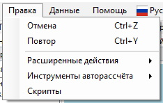
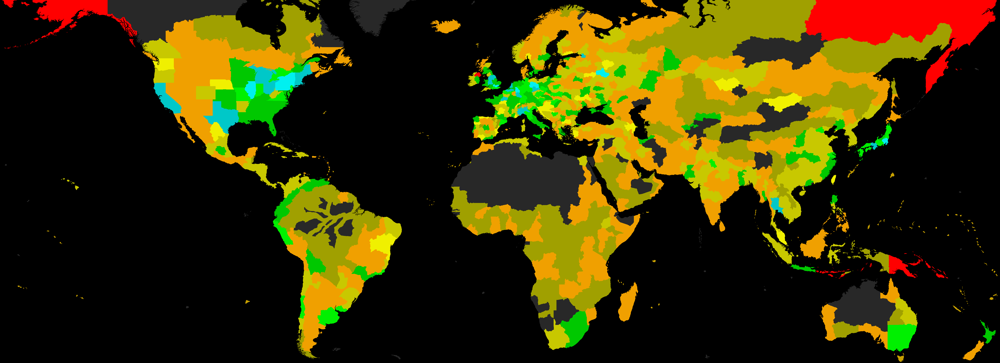
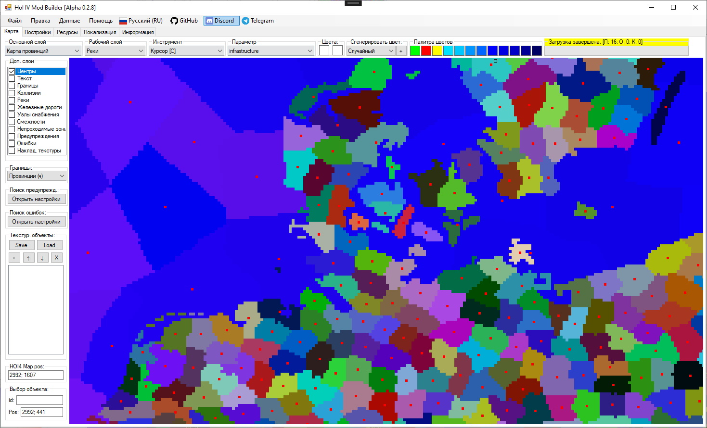
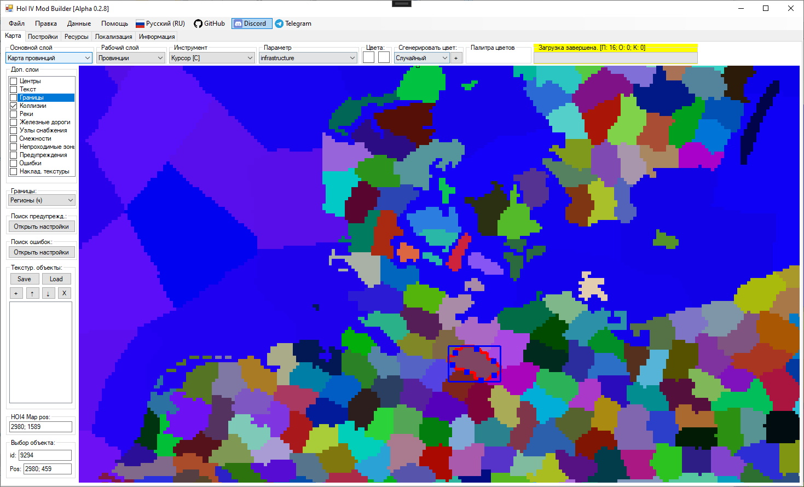
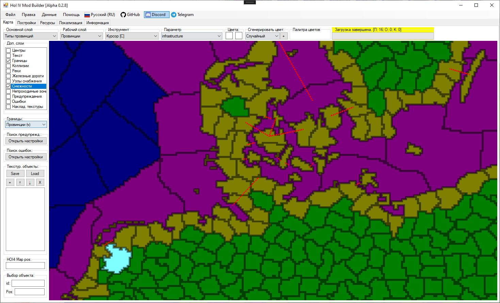

# Интерфейс карты

<!-- NAV-START -->
<!-- NAV-END -->

<!-- OTHER-LANGS-START -->
<!-- OTHER-LANGS-END -->


Описание элементов интерфейса настроек:
---
- [1] Меню программы:
  
    <details>
    <summary><i>Пункт "Файл" - основные действия для сохранения и загрузки данных</i></summary>

    
    
    
    
    
    
    
    
    </details>
    
    <details>
    <summary><i>Пункт "Правка" - основные действия для изменения данных</i></summary>

    
    
    

    </details>
    
    <details>
    <summary><i>Пункт "Данные" - основные действия для просмотра данных</i></summary>

    
    
    </details>

    <details>
    <summary><i>Пункт "Помощь" - открытие документации и основных данных о программе</i></summary>

    

    </details>
    
    Пункт "GitHub" - открывает страницу репозитория с исходным кодом и последними релизами программы на GitHub. \
    Пункт "Discord" - открывает ссылку-приглашение на вступление в Discord-сервер программы. \
    Пункт "Telegram" - открывает ссылку на Telegram-канал программы


    <details>
    <summary><i>Пункт выбора языка - позволяет выбрать один из нескольких языков локализации в приложении</i></summary>

    

    </details>
---
- [2] Вкладки редактора - на данный момент используется только ветка карты
---
- [3] Основной слой - определяет режим отрисовки основного слоя карты в программе
    <details>
    <summary><i>Подробнее</i></summary>

    

    Поддерживает отрисовку в следующих режимах:
    - Карта провинций - отрисовка провинций из provinces.bmp и definition.csv
    
    - Области - отрисовка States
    
    - Регионы - отрисовка Strategic Regions
    
    - Зоны ИИ - отрисовка Ai Areas
    
    - Страны - отрисовка контроля территорий странами
    
    - Типы провинций - отрисовка наземных, озёрных и морских провинций с учётом параметра их прибрежности из definition.csv
    
    - Местность провинций - отрисовка провинций по цвету их местности, указанной в definition.csv
    
    - Размер провинций - отрисовка провинций, где их цвет зависит от количества пикселей в данной провинции и вычисляется по логарифмической шкале от чёрного (минимальное количество пикселей) до белого (наибольшее количество пикселей)
    
    - Местность регионов - отрисовка стратегических регионов, где их цвет зависит от значения параметра naval_terrain, указанного в файлах регионов, и цвета текущей морской местности региона
    
    - Континенты - отрисовка провинций, цвет которых зависит от номера континента, указанного для провинций в файле definition.csv
    
    - Население - отрисовка областей, где их цвет зависит от населения в областей и вычисляется по логарифмической шкале от чёрного (минимальное население среди всех областей) до белого (наибольшее население среди всех областей)
    
    - Очки победы - отрисовка провинций, где их цвет зависит от количества очков победы в провинции и вычисляется по логарифмической шкале от чёрного (минимальное население среди всех провинций) до белого (наибольшее население среди всех провинций)
    
    - Категории областей - отрисовка областей, где их цвет зависит от указанных в State файлах значений State Category
    
    - Постройки - отрисовка провинций или областей, цвет которых зависит от уровня построек в провинциях и областях. Целевая постройка выбирается пользователем в выпадающем списке "Параметр" при выбранном инструменте "Постройки"
    
    - Карта местности - отрисовка карты в режиме карты местности (файл "terrain.bmp")
    
    - Карта деревьев - отрисовка карты в режиме карты деревьем (файл "trees.bmp")
    
    - Карта городов - отрисовка карты в режиме карты городов (файл "cities.bmp")
    
    - Карта высот - отрисовка карты в режиме карты высот (файл "heightmap.bmp")
    
    - Карта нормалей - отрисовка карты в режиме карты нормалей (файл "world_normals.bmp")
    
    - Кастомный скрипт - отрисовка карты по кастомному скрипту, написанному на встроенном в программу внутреннему скриптовом языке (см. подробнее в: [Внутренний скриптовый язык]())
    
    - Нет - отрисовка карты полностью в чёрном цвете

    </details>
---
- [4] Параметр основного слоя - отображается только в том случае, если выбрано значение "Кастомный скрипт" в выпадающем списке [3] Основной слой. Позволяет выбрать кастомный скрипт (текстовый файл, оканчивающийся на ".mm.txt"), который используется для определения цвета пикселей на карте (см. подробнее в: [Внутренний скриптовый язык]())
---
- [5] Рабочий слой - определяет текущий редактируемый слой карты в программе

    <details>
    <summary><i>Подробнее</i></summary>

    
    
    Поддерживает выбор редактирования следующих слоёв:
    - Провинции
    - Области
    - Регионы
    - Континенты
    - Постройки
    - Реки
    - Карта местности
    - Карта деревьев
    - Карта городов
    - Карта высот
    - Нет

    Каждый инструмент содержит свой набор слоёв, на которых он может работать и вносить изменения (см. подробнее в: [Инструменты для работы с картой]())
    </details>
---
- [6] Инструмент - определяет активный инструмент для редактирования карты

    <details>
    <summary><i>Подробнее</i></summary>

    Ниже приведено краткое описание доступных в программе инструментов. \
    Подробное описание и инструкция по работе с каждым инструментом приведены в статье: [Инструменты для работы с картой]()

    
    
    Поддерживает использование следующих инструментов:
    - Курсор (сочетание клавиш: C) - позволяет на ЛКМ выбирать объекты на картах, а на ПКМ - открывать контекстное меню действий
  
    - Прямоугольник (ВРЕМЕННО ОТКЛЮЧЕНО) - позволяет выделять на картах прямоугольные зоны
  
    - Эллипс (ВРЕМЕННО ОТКЛЮЧЕНО) - позволяет выделять на картах элипсоидные зоны
  
    - Магическая палочка (ВРЕМЕННО ОТКЛЮЧЕНО) - позволяет выделять на картах зоны сложной формы по их цвету
  
    - Кисть (сочетание клавиш: B) - позволяет рисовать на картах. Поддерживает разные кисти и диаметры. По умолчанию доступен круг радиусом от 1 до 100 пикселей. На ЛКМ красит пиксели цветом из первого слота цвета, а на ПКМ - из второго
  
    - Заливка (сочетание клавиш: F) - позволяет заливать зоны на картах выбранным цветом. На ЛКМ заливает пиксели цветом из первого слота цвета, а на ПКМ - из второго
  
    - Ластик (сочетание клавиш: E) - позволяет стирать на картах пиксели (или в некоторых случаях заливать их белым цветом). Поддерживает разные кисти и диаметры. По умолчанию доступен круг радиусом от 1 до 100 пикселей
  
    - Пипетка (сочетание клавиш: K) - позволяет выбирать (копировать) цвет пикселей на картах. На ЛКМ копирует цвет в первый слот цвета, а на ПКМ - во второй слот
  
    - Тип провинции - позволяет менять тип провинции на ЛКМ (land, lake, sea), а на ПКМ - копировать тип целевой провинции на карте
  
    - Прибрежность - позволяет редактировать тип пребрежности провинций на карте. На ЛКМ - делает провинцию прибрежной, на ПКМ - делает провинцию НЕ прибрежной
  
    - Местность (сочетание клавиш: SHIFT+T) - позволяет редактировать местность провинций на карте. На ЛКМ - устанавливает выбранную местность для целевой провинции на карте, а на ПКМ - копирует значение местности целевой провинции в выпадающий список параметра для последующего использования
  
    - Континент (сочетание клавиш: SHIFT+C) - позволяет редактировать континент провинций на карте. На ЛКМ - устанавливает выбранный континент для целевой провинции на карте, а на ПКМ - копирует значение континента целевой провинции в выпадающий список параметра для последующего использования
  
    - Область (сочетание клавиш: SHIFT+S) - позволяет редактировать область (State) провинций на карте. При передаче провинции между областями в новый State передаются также её постройки, очки победы и другие данные. На ЛКМ - устанавливает выбранную область для целевой провинции на карте, а на ПКМ - копирует значение области целевой провинции в выпадающий список параметра для последующего использования
  
    - Регион (сочетание клавиш: SHIFT+R) - позволяет редактировать регион (Strategic Region) провинций на карте. На ЛКМ - устанавливает выбранный регион для целевой провинции на карте, а на ПКМ - копирует значение региона целевой провинции в выпадающий список параметра для последующего использования
  
    - Категория области - позволяет редактировать категорию области (state_category) у целевой области (State) на карте. На ЛКМ - устанавливает выбранную категорию области для целевой области на карте, а на ПКМ - копирует значение категории области целевой области в выпадающий список параметра для последующего использования
  
    - Владелец области - позволяет редактировать страну-владельца (owner) у целевой области (State) на карте. На ЛКМ - устанавливает выбранную страну в качестве владельца области для целевой области на карте, а на ПКМ - копирует значение страны-владельна области целевой области в выпадающий список параметра для последующего использования
  
    - Контроль области - позволяет редактировать страну, контролирующую (controller) целевую область (State) на карте. На ЛКМ - устанавливает выбранную страну в качестве страны-controller области для целевой области на карте, а на ПКМ - копирует значение страны-controller области целевой области в выпадающий список параметра для последующего использования
  
    - Постройки (сочетание клавиш: SHIFT+B) - позволяет редактировать уровень построек в целовой провинции или целевой области (State) на карте (зависит от типа выбранной постройки). На ЛКМ - добавляет 1 или 10 уровней (зависит от зажатых дополнительных кнопок, подробнее см. в [Инструменты для работы с картой]()) для постройки в целевой провинции или области на карте, а на ПКМ - уменьшает уровень на 1 или 10 единиц
  
    - Зоны ИИ (SHIFT+A) - позволяет редактировать вхождение континентов или стратегических регионов в зоны ИИ (ai_areas). На ЛКМ - добавляет континент или стратегический регион в выбранную зону ИИ, а на ПКМ - убирает континент или стратегический регион из выбранной зоны ИИ

    </details>
---
- [7] Параметр - определяет активный параметр для активного инструмента. Отображается только в том случае, если инструмент требует параметр для работы
---
- [8] Значение - определяет значение выбранного параметра для активного инструмента. Отображается только в том случае, если инструмент требует параметр для работы, а параметр требует значение
---
- [9] Цвет - отображает основной (первый) и вторичный (второй) слоты для выбранных цветов.
---
- [10] Генерация цвета - в выпадающем списке можно выбрать один из четырех режимов генерации. Сгенерировать новый цвет можно нажатием на кнопку "+". Нажатие ЛКМ вставит сгенерированный цвет в основной (первый) слот для цвета, а нажатие ПКМ - во вторичный (второй) слот.

    Режимы генерации цветов:
    1. Случайный - генерируется полностью случайный цвет. Может быть получен цвет, который уже присутствует на карте провинций
    2. Наземный - генерируется новый уникальный цвет из цветового пространства наземных провинций (не влияет на тип провинции в definition.csv), ранее не представленный на карте провинций
    3. Морской - генерируется новый уникальный цвет из цветового пространства морских провинций (не влияет на тип провинции в definition.csv), ранее не представленный на карте провинций
    4. Озёрный - генерируется новый уникальный цвет из цветового пространства озёрных провинций (не влияет на тип провинции в definition.csv), ранее не представленный на карте провинций
---
- [11] Палитра цветов - на данный момент отображает только палитру цветов из rivers.bmp карты. Нажатие ЛКМ вставит выбранный цвет в основной (первый) слот для цвета, а нажатие ПКМ - во вторичный (второй) слот.
---
- [12] Прогресс-бар, отображающий текущий статус процесса загрузки или сохранения (или его результат) в формате: 

    ```
    <Статус>: [П: <количество предупреждений>; О: <Количество ошибок>; К: <количество критических ошибок>]
    ```

    <details>
    <summary><i>Подробнее</i></summary>

    В процессе загрузки данных, парсер может обнаружить некорректно заполненные участки файлов игры и/или мода. В случае возникновения каких-либо проблем, программа сообщит пользователю об этом, отобразив отдельное окно или несколько окон со списком обнаруженных проблем.

    * **Предупреждение** - некорректное заполнение файла, которое не является критичным и не влияет на работу программы. Носит рекомендательный характер к исправлению.
    
    * **Ошибка** - некорректное заполнение файла, которое может привести к потере данных при попытке выполнить сохранение информации через интерфейс программы. Не останавливает загрузку данных игры и мода, но запрещает выполнять сохранения через программу. Требует от пользователя, чтобы тот исправил найденные ошибки вручную в указанных файлах.
    
    * **Критическая ошибка** - некорректное заполнение файла, которое приводит к преждевременной остановке загрузки данных игры и мода. Требует от пользователя исправление ошибки вручную в указанном файле.

    Пример окна со списком Предупреждений приведён ниже.

    

    </details>

---
- [13] Дополнительные слои - текстурные карты или объекты, накладываемые поверх основного слоя карты.
    
    Список дополнительных слоёв:
    - Центры - включает отображение центров провинций на карте
    
    - Границы - включает отображение белых или чёрных границ провинций, областей или регионов (тип и цвет выбираются в выпадающем списке [14] "Границы")
    
    
    
    - Реки - включает отображение рек поверх основного слоя. (Для редактирования рек, выберите рабочий слой "Реки" и инструмент "Кисть" или "Ластик" в выпадающем списке инструментов)
    
    - Железные дороги - включает отображение железных дорог поверх основного слоя (о создании, редактировании и удалении см. подробнее в: [Инструменты для работы с картой]()) 
    
    - Узлы снабжения - включает отображение узлов снабжения поверх основного слоя (о создании, редактировании и удалении см. подробнее в: [Инструменты для работы с картой]())
    
    - Смежности - включает отображение смежностей между провинциями из файла adjacencies.csv (о создании, редактировании и удалении см. подробнее в: [Инструменты для работы с картой]())
    
    - Непроходимые зоны - временно отключено и не работает
    - Предупреждения
    
    - Ошибки
    
    - Накладываемые текстуры