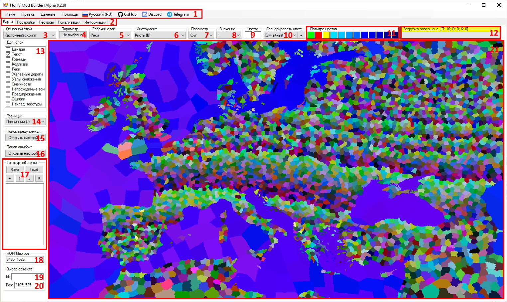
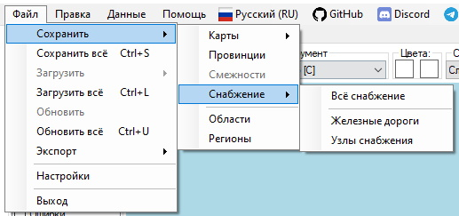
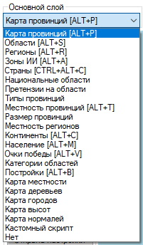
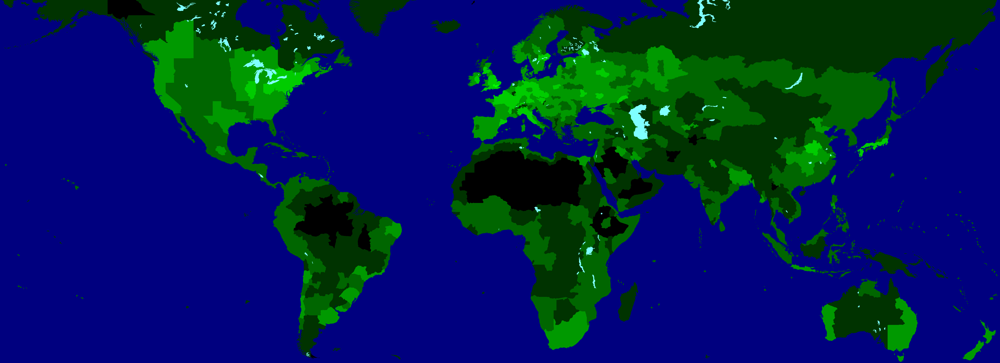
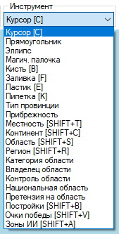
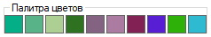
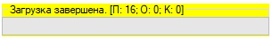
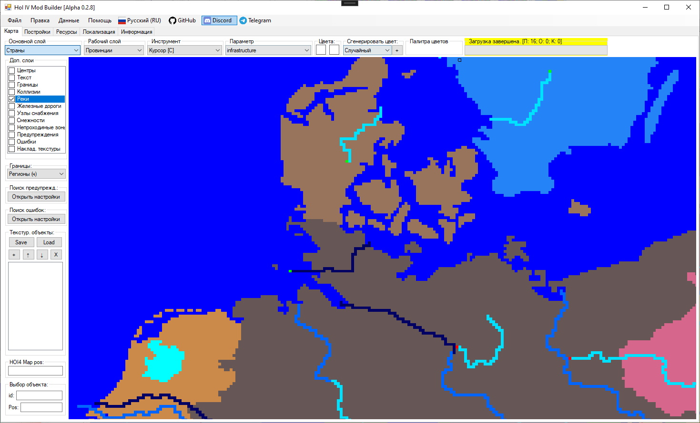
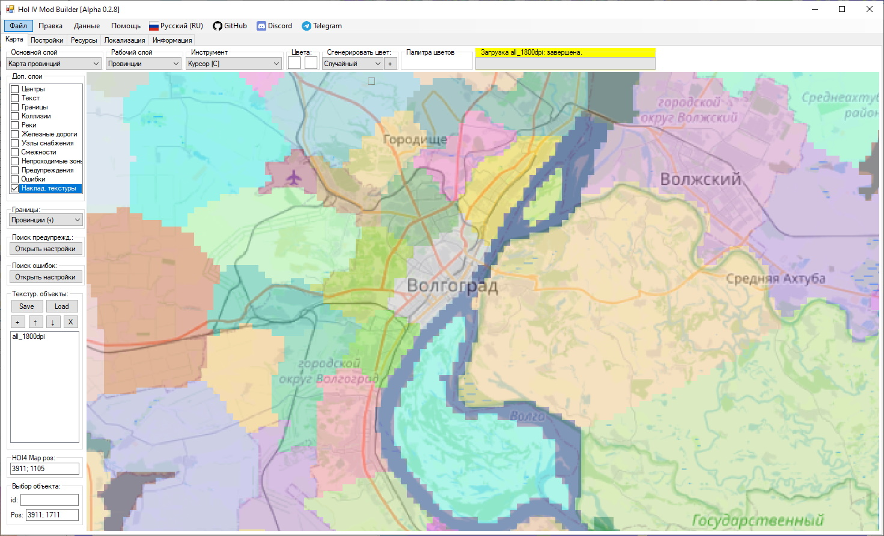
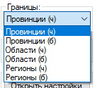

# Интерфейс карты и навигация

<!-- NAV-START -->
<!-- NAV-END -->

<!-- OTHER-LANGS-START -->
<!-- OTHER-LANGS-END -->

В данной статье приведено краткое описание элементов владки для работы с игровой карты. Основы навигации для работы с картой приведены во второй половине статьи.




Описание элементов интерфейса карты:
---
- [1] Меню программы:
  
    Пункт "Файл" - основные действия для сохранения и загрузки данных

    

    <details>
    <summary><i>Подробнее</i></summary>
    
    
    
    
    
    
    
    </details>
    
    ---

    Пункт "Правка" - основные действия для изменения данных.

    

    <details>
    <summary><i>Подробнее</i></summary>
    
    
    
    

    </details>

    ---

    Пункт "Данные" - основные действия для просмотра данных и восстановления старых данных. Позволяет также изменить текущую активную Bookmark мода.

    

    <details>
    <summary><i>Подробнее</i></summary>

    
    
    </details>

    ---
    
    Пункт "Помощь" - открытие документации и основных данных о программе

    

    ---
    
    Пункт "GitHub" - открывает страницу репозитория с исходным кодом и последними релизами программы на GitHub.

    ---

    Пункт "Discord" - открывает ссылку-приглашение на вступление в Discord-сервер программы.

    ---

    Пункт "Telegram" - открывает ссылку на Telegram-канал программы

    ---

    Пункт выбора языка - позволяет выбрать один из нескольких языков локализации в приложении

    
---
- [2] Вкладки редактора - на данный момент используется только ветка карты
---
- [3] Основной слой - определяет режим отрисовки основного слоя карты в программе

    

    <details>
    <summary><i>Подробнее</i></summary>

    Поддерживает отрисовку в следующих режимах:
    - Карта провинций (сочетание клавиш: ALT+P) - отрисовка провинций из provinces.bmp и definition.csv
    
    - Области (сочетание клавиш: ALT+S) - отрисовка States
    
    - Регионы (сочетание клавиш: ALT+R) - отрисовка Strategic Regions
    
    - Зоны ИИ (сочетание клавиш: ALT+A) - отрисовка Ai Areas
    
    - Страны (сочетание клавиш: CTRL+ALT+C) - отрисовка контроля территорий странами
    
    - Национальные области - отрисовка национальных областей для выбранной страны (пример: Германия)
    
    - Претензии на области - отрисовка претензий на области для выбранной страны (пример: Германия)
    
    - Типы провинций - отрисовка наземных, озёрных и морских провинций с учётом параметра их прибрежности из definition.csv
    
    - Местность провинций (сочетание клавиш: ALT+T) - отрисовка провинций по цвету их местности, указанной в definition.csv
    
    - Размер провинций - отрисовка провинций, где их цвет зависит от количества пикселей в данной провинции и вычисляется по логарифмической шкале от чёрного (минимальное количество пикселей) до белого (наибольшее количество пикселей)
    
    - Местность регионов - отрисовка стратегических регионов, где их цвет зависит от значения параметра naval_terrain, указанного в файлах регионов, и цвета текущей морской местности региона
    
    - Континенты (сочетание клавиш: ALT+C) - отрисовка провинций, цвет которых зависит от номера континента, указанного для провинций в файле definition.csv
    
    - Население (сочетание клавиш: ALT+M) - отрисовка областей, где их цвет зависит от населения в областей и вычисляется по логарифмической шкале от чёрного (минимальное население среди всех областей) до белого (наибольшее население среди всех областей)
    
    - Очки победы (сочетание клавиш: ALT+V) - отрисовка провинций, где их цвет зависит от количества очков победы в провинции и вычисляется по логарифмической шкале от чёрного (минимальное население среди всех провинций) до белого (наибольшее население среди всех провинций)
    
    - Категории областей - отрисовка областей, где их цвет зависит от указанных в State файлах значений State Category
    
    - Постройки (сочетание клавиш: ALT+B) - отрисовка провинций или областей, цвет которых зависит от уровня построек в провинциях и областях. Целевая постройка выбирается пользователем в выпадающем списке "Параметр" при выбранном инструменте "Постройки"
    
    - Карта местности - отрисовка карты в режиме карты местности (файл "terrain.bmp")
    
    - Карта деревьев - отрисовка карты в режиме карты деревьем (файл "trees.bmp")
    
    - Карта городов - отрисовка карты в режиме карты городов (файл "cities.bmp")
    
    - Карта высот - отрисовка карты в режиме карты высот (файл "heightmap.bmp")
    
    - Карта нормалей - отрисовка карты в режиме карты нормалей (файл "world_normals.bmp")
    
    - Кастомный скрипт - отрисовка карты по кастомному скрипту, написанному на встроенном в программу внутреннему скриптовом языке (см. подробнее в: [Внутренний скриптовый язык]())
    
    - Нет - отрисовка карты полностью в белом цвете

    </details>
---
- [4] Параметр основного слоя - отображается только в том случае, если выбрано значение "Кастомный скрипт" в выпадающем списке "Основной слой" [3]. Позволяет выбрать кастомный скрипт (текстовый файл, оканчивающийся на ".mm.txt"), который используется для определения цвета пикселей на карте (см. подробнее в: [Внутренний скриптовый язык]())
---
- [5] Рабочий слой - определяет текущий редактируемый слой карты в программе

    

    <details>
    <summary><i>Подробнее</i></summary>
    
    Поддерживает выбор редактирования следующих слоёв:
    - Провинции
    - Области
    - Регионы
    - Континенты
    - Постройки
    - Реки
    - Карта местности
    - Карта деревьев
    - Карта городов
    - Карта высот
    - Нет

    Каждый инструмент содержит свой набор слоёв, на которых он может работать и вносить изменения (см. подробнее в: [Инструменты для работы с картой]())
    </details>
---
- [6] Инструмент - определяет активный инструмент для редактирования карты

    

    <details>
    <summary><i>Подробнее</i></summary>

    Ниже приведено краткое описание доступных в программе инструментов. \
    Подробное описание и инструкция по работе с каждым инструментом приведены в статье: [Инструменты для работы с картой]()
    
    Поддерживает использование следующих инструментов:
    - Курсор (сочетание клавиш: C) - позволяет на ЛКМ выбирать объекты на картах, а на ПКМ - открывать контекстное меню действий
  
    - Прямоугольник (ВРЕМЕННО ОТКЛЮЧЕНО) - позволяет выделять на картах прямоугольные зоны
  
    - Эллипс (ВРЕМЕННО ОТКЛЮЧЕНО) - позволяет выделять на картах элипсоидные зоны
  
    - Магическая палочка (ВРЕМЕННО ОТКЛЮЧЕНО) - позволяет выделять на картах зоны сложной формы по их цвету
  
    - Кисть (сочетание клавиш: B) - позволяет рисовать на картах. Поддерживает разные кисти и диаметры. По умолчанию доступен круг радиусом от 1 до 100 пикселей. На ЛКМ красит пиксели цветом из первого слота цвета, а на ПКМ - из второго
  
    - Заливка (сочетание клавиш: F) - позволяет заливать зоны на картах выбранным цветом. На ЛКМ заливает пиксели цветом из первого слота цвета, а на ПКМ - из второго
  
    - Ластик (сочетание клавиш: E) - позволяет стирать на картах пиксели (или в некоторых случаях заливать их белым цветом). Поддерживает разные кисти и диаметры. По умолчанию доступен круг радиусом от 1 до 100 пикселей
  
    - Пипетка (сочетание клавиш: K) - позволяет выбирать (копировать) цвет пикселей на картах. На ЛКМ копирует цвет в первый слот цвета, а на ПКМ - во второй слот
  
    - Тип провинции - позволяет менять тип провинции на ЛКМ (land, lake, sea), а на ПКМ - копировать тип целевой провинции на карте
  
    - Прибрежность - позволяет редактировать тип пребрежности провинций на карте. На ЛКМ - делает провинцию прибрежной, на ПКМ - делает провинцию НЕ прибрежной
  
    - Местность (сочетание клавиш: SHIFT+T) - позволяет редактировать местность провинций на карте. На ЛКМ - устанавливает выбранную местность для целевой провинции на карте, а на ПКМ - копирует значение местности целевой провинции в выпадающий список параметра для последующего использования
  
    - Континент (сочетание клавиш: SHIFT+C) - позволяет редактировать континент провинций на карте. На ЛКМ - устанавливает выбранный континент для целевой провинции на карте, а на ПКМ - копирует значение континента целевой провинции в выпадающий список параметра для последующего использования
  
    - Область (сочетание клавиш: SHIFT+S) - позволяет редактировать область (State) провинций на карте. При передаче провинции между областями в новый State передаются также её постройки, очки победы и другие данные. На ЛКМ - устанавливает выбранную область для целевой провинции на карте, а на ПКМ - копирует значение области целевой провинции в выпадающий список параметра для последующего использования
  
    - Регион (сочетание клавиш: SHIFT+R) - позволяет редактировать регион (Strategic Region) провинций на карте. На ЛКМ - устанавливает выбранный регион для целевой провинции на карте, а на ПКМ - копирует значение региона целевой провинции в выпадающий список параметра для последующего использования
  
    - Категория области - позволяет редактировать категорию области (state_category) у целевой области (State) на карте. На ЛКМ - устанавливает выбранную категорию области для целевой области на карте, а на ПКМ - копирует значение категории области целевой области в выпадающий список параметра для последующего использования
  
    - Владелец области - позволяет редактировать страну-владельца (owner) у целевой области (State) на карте. На ЛКМ - устанавливает выбранную страну в качестве владельца области для целевой области на карте, а на ПКМ - копирует значение страны-владельна области целевой области в выпадающий список параметра для последующего использования
  
    - Контроль области - позволяет редактировать страну, контролирующую (controller) целевую область (State) на карте. На ЛКМ - устанавливает выбранную страну в качестве страны-controller области для целевой области на карте, а на ПКМ - копирует значение страны-controller области целевой области в выпадающий список параметра для последующего использования

    - Национальная область - позволяет редактировать список национальных областей выбранной страны. На ЛКМ - добавляет область в список национальных областей страны, а на ПКМ - убирает облать из списка национальных областей страны

    - Претензия на область - позволяет редактировать список претензий выбранной страны на области на карты. На ЛКМ - добавляет претензию выбранной страны на область, а на ПКМ - убирает претензию страны на область
  
    - Постройки (сочетание клавиш: SHIFT+B) - позволяет редактировать уровень построек в целовой провинции или целевой области (State) на карте (зависит от типа выбранной постройки). На ЛКМ - добавляет 1 или 10 уровней (зависит от зажатых дополнительных кнопок, подробнее см. в [Инструменты для работы с картой]()) для постройки в целевой провинции или области на карте, а на ПКМ - уменьшает уровень на 1 или 10 единиц
  
    - Очки победы (сочетание клавиш: SHIFT+V) - позволяет редактировать количество очков победы в целевой провинции на карте. На ЛКМ - добавляет 1, 10 или 100 очков победы (зависит от зажатых дополнительных кнопок, подробнее см. в [Инструменты для работы с картой]()) в целевую провинцию, а на ПКМ - уменьшает значение на 1, 10 или 100 очков победы

    - Зоны ИИ (сочетание клавиш: SHIFT+A) - позволяет редактировать вхождение континентов или стратегических регионов в зоны ИИ (ai_areas). На ЛКМ - добавляет континент или стратегический регион в выбранную зону ИИ, а на ПКМ - убирает континент или стратегический регион из выбранной зоны ИИ

    </details>
---
- [7] Параметр - определяет активный параметр для активного инструмента. Отображается только в том случае, если инструмент требует параметр для работы
---
- [8] Значение - определяет значение выбранного параметра для активного инструмента. Отображается только в том случае, если инструмент требует параметр для работы, а параметр требует значение
---
- [9] Цвет - отображает основной (первый) и вторичный (второй) слоты для выбранных цветов. Нажатие ЛКМ на любой из слотов для цветов включает/выключает отображение окна выбора цвета.
  
    
---
- [10] Генерация цвета - в выпадающем списке можно выбрать один из четырех режимов генерации. Сгенерировать новый цвет можно нажатием на кнопку "+". Нажатие ЛКМ вставит сгенерированный цвет в основной (первый) слот для цвета, а нажатие ПКМ - во вторичный (второй) слот.

    

    Режимы генерации цветов:

    1. Случайный - генерируется полностью случайный цвет. Может быть получен цвет, который уже присутствует на карте провинций
    2. Наземный - генерируется новый уникальный цвет из цветового пространства наземных провинций (не влияет на тип провинции в definition.csv), ранее не представленный на карте провинций
    3. Морской - генерируется новый уникальный цвет из цветового пространства морских провинций (не влияет на тип провинции в definition.csv), ранее не представленный на карте провинций
    4. Озёрный - генерируется новый уникальный цвет из цветового пространства озёрных провинций (не влияет на тип провинции в definition.csv), ранее не представленный на карте провинций
---
- [11] Палитра цветов - отображающий список цветов, доступных для быстрого выбора. Нажатие ЛКМ по цвету вставляет его в основной (первый) слот цвета для инструмента, а ПКМ - во вторичный (второй).
  
  Если выбран рабочий слой "Реки", то в палитре отображаются цвета из rivers.bmp карты, используемые для рисования рек.

    
  
  Если выбран любой другой рабочий слой, то отображается история из последних выбранных цветов (не более 10).

    
---
- [12] Прогресс-бар, отображающий текущий статус процесса загрузки или сохранения (или его результат) в формате: 

    ```
    <Статус>: [П: <количество предупреждений>; О: <Количество ошибок>; К: <количество критических ошибок>]
    ```

    

    <details>
    <summary><i>Подробнее</i></summary>

    В процессе загрузки данных, парсер может обнаружить некорректно заполненные участки файлов игры и/или мода. В случае возникновения каких-либо проблем, программа сообщит пользователю об этом, отобразив отдельное окно или несколько окон со списком обнаруженных проблем.

    * **Предупреждение** - некорректное заполнение файла, которое не является критичным и не влияет на работу программы. Носит рекомендательный характер к исправлению.
    
    * **Ошибка** - некорректное заполнение файла, которое может привести к потере данных при попытке выполнить сохранение информации через интерфейс программы. Не останавливает загрузку данных игры и мода, но запрещает выполнять сохранения через программу. Требует от пользователя, чтобы тот исправил найденные ошибки вручную в указанных файлах.
    
    * **Критическая ошибка** - некорректное заполнение файла, которое приводит к преждевременной остановке загрузки данных игры и мода. Требует от пользователя исправление ошибки вручную в указанном файле.

    Пример окна со списком Предупреждений приведён ниже.

    

    </details>

---
- [13] Дополнительные слои - текстурные карты или объекты, накладываемые поверх основного слоя карты.
    
    <details>
    <summary><i>Подробнее</i></summary>

    Список дополнительных слоёв:
    - Центры - включает отображение центров провинций на карте
    
    - Границы - включает отображение белых или чёрных границ провинций, областей или регионов (тип и цвет выбираются в выпадающем списке [14] "Границы")
    
    
    
    - Реки - включает отображение рек поверх основного слоя. (Для редактирования рек, выберите рабочий слой "Реки" и инструмент "Кисть" или "Ластик" в выпадающем списке инструментов)
    
    - Железные дороги - включает отображение железных дорог поверх основного слоя (о создании, редактировании и удалении см. подробнее в: [Инструменты для работы с картой]()) 
    
    - Узлы снабжения - включает отображение узлов снабжения поверх основного слоя (о создании, редактировании и удалении см. подробнее в: [Инструменты для работы с картой]())
    
    - Смежности - включает отображение смежностей между провинциями из файла adjacencies.csv (о создании, редактировании и удалении см. подробнее в: [Инструменты для работы с картой]())
    
    - Непроходимые зоны - временно отключено и не работает
    - Предупреждения - включает отображение связанных с картой предупреждений, которые не являются критичными, но на них следует обратить внимание (см. подробнее в: [Поиск предупреждений и ошибок на карте]())
    
    - Ошибки - включает отображение важных и/или критических связанных с игровой картой ошибок, которые в том числе могут приводить к крашу игры (см. подробнее в: [Поиск предупреждений и ошибок на карте]())
    
    - Накладываемые текстуры - включает отображение накладываемых поверх игровой карты дополнительных пользовательских текстур. Пример использования: наложение реальных карт, на основе которых можно создавать и редактировать игровую карту (см. подробнее в: [Накладываемые текстурные объекты]())
    

    </details>

---
- [14] Границы - позволяет настроить цвет (белый и черный) отображения границ на карте (границы провинций, областей и регионов)

  
  
---
- [15] Настройки поиска предупреждений - позволяет выбрать список предупреждений, связанных с картой, которые программе необходимо найти и вывести при загрузке или обновлении данных мода (см. подробнее в: [Поиск предупреждений и ошибок на карте]())
  
  Отображение предупреждений на карте включается соответствующим пунктом в [13] "Доп. слои" 

  

---
- [16] Настройки поиска ошибок - позволяет выбрать список важных и критических ошибок, связанных с картой, которые программе необходимо найти и вывести при загрузке или обновлении данных мода (см. подробнее в: [Поиск предупреждений и ошибок на карте]())
  
  Отображение ошибок на карте включается соответствующим пунктом в [13] "Доп. слои" 

  

---
- [17] Текстурные объекты - позволяет загружать, настраивать порядок, удалять, сохранять и загружать группы пресетов текстурных объектов поверх основной карты.
  
  Пример использования: наложение реальных карт, на основе которых можно создавать и редактировать игровую карту (см. подробнее в: [Накладываемые текстурные объекты]())

  

---
- [18] Позиция выбранной точки на карте в системе кординат игры (точка отсчёта координат находится в левом нижнем углу карты, ось Y направлена вверх)

  

---
- [19] ID выбранных объектов (провинций, областей или регионов) на карте. Тип выбираемого объекта зависит от текущего выбранного [5] Рабочего слоя (если выбрано значение "Провинции", то выбираются провинции на карте, если "Области" - то области, "Регионы" - то регионы).
  
  Если зажать SHIFT и нажимать ЛКМ на объекты на карте, они будут добавляться в группу выбранных объектов (или удаляться при повторном нажатии). ID выбранных объектов на карте записывается в строку с пробелом в виде символа-разделителя

  
  
---
- [20] Позиция выбранной точки на карте в системе кординат программы/графических редакторов (точка отсчёта координат находится в левом верхнем углу карты, ось Y направлена вниз)

  

---
- [21] Окно отображения карты мода - отображает карту мода и связанные с ней объекты

  

Навигация по карте:
---

Основные доступные действия:

1. Нажатие ЛКМ - выбор (выделение) объекта на карте \
  

  ---
2. Нажатие SHIFT+ЛКМ - множественный выбор (выделение) объектов на карте. Повторное нажатие на выделенный объект снимает с него выделение \
  

  ---
3. Нажатие ПКМ - вторичный выбор (выделение) объекта и открытие контекстного меню с действиями \
  
  
    <details>
    <summary><i>Подробнее о контекстном меню</i></summary>
    
    ---
    Пункт меню "Поиск" - позволяет выполнять быстрый поиск и, если это предусмотрено, выделение объектов на карте по данным, указанным в текстовом поле выпадающего окна.

    1. Найти точку - фокусирует камеру на точке на карте, координаты которой указаны в текстовом поле в формате "x; y"
    2. Найти провинцию(-и) - выделяет одну или группу провинций и фокусирует камеру на провинциях, id которых указаны в текстовом поле в формате "1 2 3" (пробел является символом-разделителем между id провинций)
    3. Найти область(-и) - выделяет одну или группу областей (states) и фокусирует камеру на областях, id которых указаны в текстовом поле в формате "1 2 3" (пробел является символом-разделителем между id областей)
    4. Найти регион(-и) - выделяет один или группу регионов (strategic regions) и фокусирует камеру на регионах, id которых указаны в текстовом поле в формате "1 2 3" (пробел является символом-разделителем между id регионов)

    

    ---
    Пункт меню "Провинция" - выводит краткую информацию о провинции и даёт ещё один способ (помимо соответствующих инструментов, см. подробнее [Инструменты для работы с картой]()) для редактирования таких параметров провинции, как:
    1. Принадлежность к области (state)
    2. Принадлежность к региона (strategic region)
    3. Тип провинции (land, sea, lake)
    4. Прибрежность провинции (isCoastal)
    5. Местность провинции (terrain)
    6. Континент провинции (continent)
    7. Значение очков победы в провинции (victory points)

    

    ---
    Пункт меню "Смежность" - позволяет создавать, редактировать и удалять смежности (adjacencies) между провинциями.

    Для создании смежности, выберите первую провинцию нажатием ЛКМ по карте, потом выберите вторую провинцию нажатием ПКМ. В открывшемся контекстном меню выберите пункт "Смежность" и "Создать межность".

    

    Чтобы увидеть созданную смежность, включите в "Доп. слои" отображение смежностей.

    

    Чтобы редактировать смежность на карте, выберите её нажатием ЛКМ (выбранная смежность изменит свой цвет с красного на синий), а затем нажмите ПКМ и откройте в контекстном меню пункт "Смежность".

    Теперь вы можете поменять:
    1. Тип смежности (NONE, SEA, LAKE, IMPASSIBLE)
    2. Удалить смежность
    3. Установить первую провинцию в смежности (кнопка) - первой провинцией будет установлена та провинция, по которой вы ранее нажали ПКМ и границы которой отображаются на карте оранжевым цветом (текущая первая провинция отмечается красным квадратом на карте)
    4. Установить первую провинцию в смежности по ID (текстовое поле)
    5. Установить первую точку смежности (кнопка) - по умолчанию точка находится в центре первой провинции смежности (провинции с красной точкой) и игра самостоятельно выбирает точку на карте по внутреннему алгоритму. Нажав на данную кнопку, вы можете задать конкретную точку на карте, из которой визуально в игре будет выходить первый конец смежности
    6. Установить первую точку смежности по координатам (текстовое поле) - координаты указываются в формате "x; y"
    7. Установить вторую провинцию в смежности (кнопка) - второй провинцией будет установлена та провинция, по которой вы ранее нажали ПКМ и границы которой отображаются на карте оранжевым цветом (текущая вторая провинция отмечается синим квадратом на карте)
    8. Сбросить первую точку - позволяет сбросить указанные координаты точки первого конца смежности до "-1; -1", чтобы смежность использовала координаты центра первой провинции 
    9. Установить вторую провинцию в смежности по ID (текстовое поле)
    10. Установить вторую точку смежности (кнопка) - по умолчанию точка находится в центре второй провинции смежности (провинции с синей точкой) и игра самостоятельно выбирает точку на карте по внутреннему алгоритму. Нажав на данную кнопку, вы можете задать конкретную точку на карте, из которой визуально в игре будет выходить второй конец смежности
    11. Установить вторую точку смежности по координатам (текстовое поле) - координаты указываются в формате "x; y"
    12. Сбросить вторую точку- позволяет сбросить указанные координаты точки второго конца смежности до "-1; -1", чтобы смежность использовала координаты центра второй провинции
    13. Установить среднюю провинцию (кнопка) - средней провинцией будет установлена та провинция, по которой вы ранее нажали ПКМ и границы которой отображаются на карте оранжевым цветом (текущая вторая провинция отмечается зелёным квадратом на карте). Средняя провинция используется для смежностей, соединяющих через воду два участка суши, переход по которым для юнитов может быть заблокирован вражеским флотом
    14. Установить среднюю провинцию по ID (текстовое поле)
    15. Выбор правила для смежности (adjacency_rule) - позволяет указать, какое правило будет использоваться смежностью
    16. Добавить требуемую провинцию - позволяет добавить в список требуемых провинций (required_provinces) у выбранного правила смежности(adjacency_rule) провинцию, по которой вы ранее нажали ПКМ и границы которые которой отображаются на карте голубым цветом
    17. Удалить требуемую провинция - позволяет удалить из списока требуемых провинций (required_provinces) у выбранного правила смежности(adjacency_rule) провинцию, по которой вы ранее нажали ПКМ и границы которые которой отображаются на карте голубым цветом
    18. Поле для комментария к выбранной смежности

    

    ---
    Пункт меню "Железная дорога" - позволяет создавать, редактировать, разделять, соединять и удалять железные дороги. 
    
    Чтобы увидеть железные дороги на карте, не забудьте включить их отображение в "Доп. слои".

    

    </details>

  ---
1. Вращение колеса мыши - изменения уровня зума карты. Точка фокусировки камеры при зуме зависит от положения курсора мыши \
  

  ---
5. Зажатие колеса мыши и перемещение курсора - изменение положения камеры относительно карты \
  

  ---
6. Нажатие Esc - снятие выделения объекта(-ов)
   
  ---
7. Нажатие Delete - удаление выделенного объекта(-ов), если это возможно (к примеру, удаление узлов снабжения, железных догор, смежностей и т.п., но не провинций, областей, регионов и т.д.)