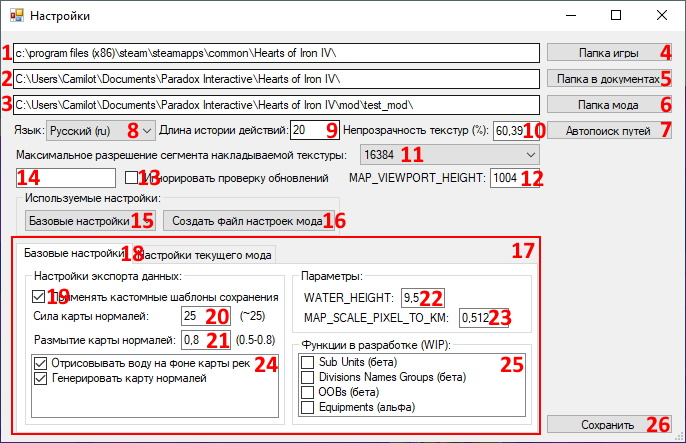

# Окно настроек

<!-- NAV-START -->
<!-- NAV-END -->

<!-- OTHER-LANGS-START -->
<!-- OTHER-LANGS-END -->

Чтобы открыть окно настроек, в меню программы нажмите на пункт "Файл", а затем кликните на кнопку "Настройки".

После нажатия у вас откроется окно настроек.

Описание элементов интерфейса настроек:

- [1] Путь до основной папки игры, в которой расположен файл "hoi4.exe"
  
- [2] Путь до папки игры в Документах 
  
- [3] Путь до папки мода 
  
- [4] Кнопка открытия диалогового окна выбора пути до основной папки игры, в которой расположен файл "hoi4.exe"
  
- [5] Кнопка открытия диалогового окна выбора пути до папки игры в Документах
   
- [6] Кнопка открытия диалогового окна выбора пути до папки мода 
  
- [7] Выбор языка локализации текста в программе (можно также изменить через верхнее меню в основном окне программы) 
  
- [8] Длина истории действий (CTLR+Z - отменить, CTRL+Y - повторить)
  
- [9] Непрозрачность (в процентах) накладываемых на карту дополнительных кастомных текстур (см. подробнее в: [Накладываемые текстуры]())
  
- [10] Максимальное разрешение сегмента накладываемой текстуры определяет степень дробления больших текстур на более мелкие участки (см. подробнее в: [Накладываемые текстуры]())
  
- [11] Высота окна отрисовки изображения Гугл карт в Браузере, где делается скриншот для получения накладываемой текстуры (см. подробнее в: [Накладываемые текстуры]())
  
- [12] Кнопка игнорирования проверки новых обновлений Программы (см. подробнее в: [Проверка обновлений]())
  
- [13] Название конкретного обновления, игнорируемого системой проверки обновлений Программы (см. подробнее в: [Проверка обновлений]())
  
- [14] Выбор пресета используемых настроек (либо общие базовые настройки, либо настройки загруженного мода, которые синхронизируются между разработчиками мода через Git и хранятся по пути: "С:/Documents/Paradox Interactive/Hearts of Iron IV/mod/.../.hoi4modbuilder/settings.json")

Продолжение описания элементов интерфейса настроек:
  
- [15] Кнопка создания файла настроек мода в его папке
  
- [16] Зона интерфейса для изменения пресета настроек
  
- [17] Переключаемые вкладки для изменения Базовых настроек и Настроек мода
  
- [18] Параметр, включающий использование кастомных шаблонов сохранения данных в файлах мода: (см. подробнее в: [Шаблоны сохранения данных]())
  
- [19] Параметр, отвечающий за силу (резкость) генерируемой и экспортируемой карты нормалей при сохранении данных мода. (Рекомендуемое значение, дающее результат, близкий к генерации в MapGen: ~25)
  
- [20] Параметр, отвечающий за размытие генерируемой и экспортируемой карты нормалей при сохранении данных мода. (Рекомендуемое значение, дающее результат, близкий к генерации в MapGen: 0.5 - 0.8)
  
- [21] Дополнительные параметры настройки экспорта (отрисовка озёр и океанов на карте rivers.bmp; генерация карты нормалей на базе карты высот при сохранении данных)
  
- [22] Параметр уровня моря из DEFINES (временно вынесен в настройки)
  
- [23] Параметр масштаба игровой карты (временной вынесен в настройки)
  
- [24] Переключение состояния функций программы, находящихся в разработке (на данный момент: сабюниты, группы названий дивизий, OOB и снаряжение)
  
- [25] Кнопка сохранения настроек

