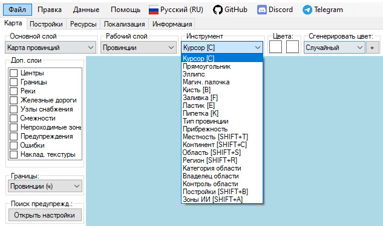
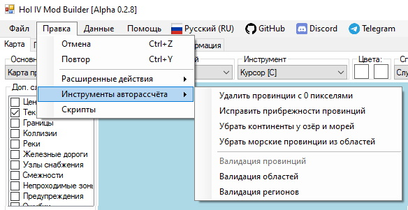

# [🠈](../Documentation.md) | Инструменты

### Для просмотра сценариев использования инструмента и его подробного описания нажмите на его название.

## Базовые инструменты
1. [Курсор]() [C] - позволяет выбирать объекты на карте;
2. [Прямоугольник]() - временно отключен;
3. [Эллипс]() - временно отключен;
4. [Магическая палочка]() - временно отключен;
5. [Кисть]() [B] - позволяет рисовать на текстурных картах выбранным цветом;
6. [Заливка]() [F] - позволяет заливать область на текстурных картах выбранным цветом;
7. [Ластик]() [E] - позволяет стрирать цвет пикселей на текстурных картах;
8. [Пипетка]() [K] - позволяет копировать цвет из целевого пикселя на текстурных картах;
9. [Тип провинции]() - позволяет изменять тип провинций (land, sea, lake) на карте;
10. [Прибрежность]() - позволяет изменять прибрежность (isCoastal) провинций на карте;
11. [Местность]() [SHIFT+T] - позволяет изменять местность провинций (terrain) на карте;
12. [Континент]() [SHIFT+C] - позволяет изменять континент (continent) провинций на карте;
13. [Область]() [SHIFT+S] - позволяет редактировать принадлежность провинций на карте к областям (states);
14. [Регион]() [SHIFT+R] - позволяет редактировать принадлежность провинций на карте к регионам (strategic regions);
15. [Категория области]() - позволяет редактировать категории областей (states) на карте;
16. [Владелец области]() - позволяет редактировать странцу-владельца (owner) областей (states) на карте;
17. [Контроль области]() - позволяет редактировать страну-контроллера (controller) областей (states) на карте;
18. [Постройки]() [SHIFT+B] - позволяет редактировать количество построек (buildings) в провинциях и областях (states) на карте;
19. [Зоны ИИ]() [SHIFT+A] - позволяет редактировать границы зон ИИ (ai areas) на карте.

## Расширенные инструменты
1. [Железные дороги](advanced/railway/lang=ru.md) - позволяет создавать, изменять, разделять, соединять и удалять железные дороги на карте;
2. [Узлы снабжения]() - позволяет создавать и удалять узлы снабжения на карте;
3. [Объединение провинций]() - позволяет быстро объединять провинции на карте, уменьшая их общее количество.

## Инструменты авторассчёта
Инструменты авторассчёта позволяют

1. Удалить провинции с 0 пикселями - удаляет из definition.csv объявление провинций, если их нет на карте. Освобождаемые ID от удаляемых провинций передаются другим провинциям на карте, чтобы уменьшить их общее количество в моде;
2. Исправить прибрежности провинций;
3. Убрать континенты у озёр и морей;
4. Убрать морские провинции из областей;
5. Валидация провинций - временно отключено;
6. Валидация областей - для каждой области (state) выполняет следующие действия:
   1. Сортирует провинции в области по увеличению ID;
   2. Удаляет повторные записи ID провинции в области;
   3. Удаляет провинцию из области, если она уже приписана к другой области;
   4. Переносит очки победы (victory points) в другую (правильную) область, если в файле текущей области очки победы прописаны для провинции, которая относится к другой области. 
7. Валидация регионов - для каждого региона (strategic region) выполняет следующие действия:
   1. Сортирует провинции в регионе по увеличению ID;
   2. Удаляет повторные записи ID провинции в регионе;
   3. Удаляет провинцию из региона, если она уже приписана к другому региону.

Доступ к списку инструментов авторассчёта осуществляется через меню программы "Правка" и "Инструменты авторассчёта".

