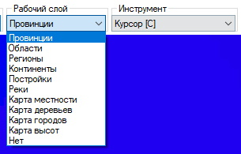
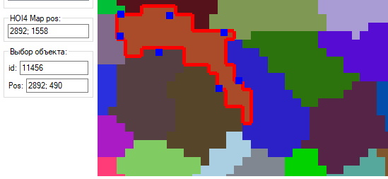
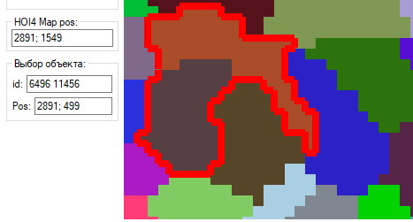
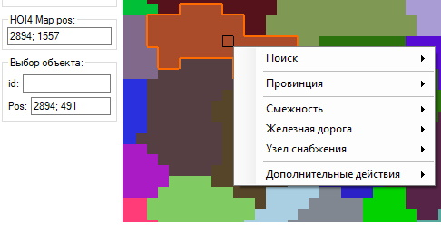
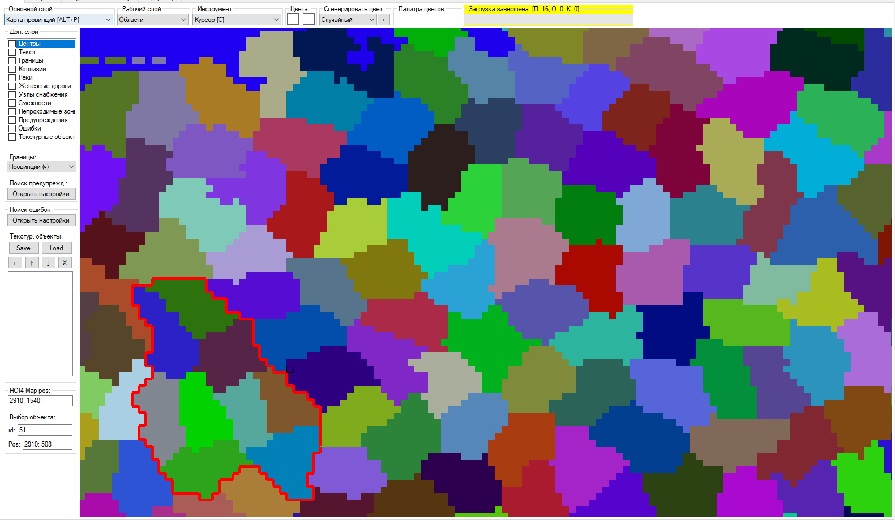
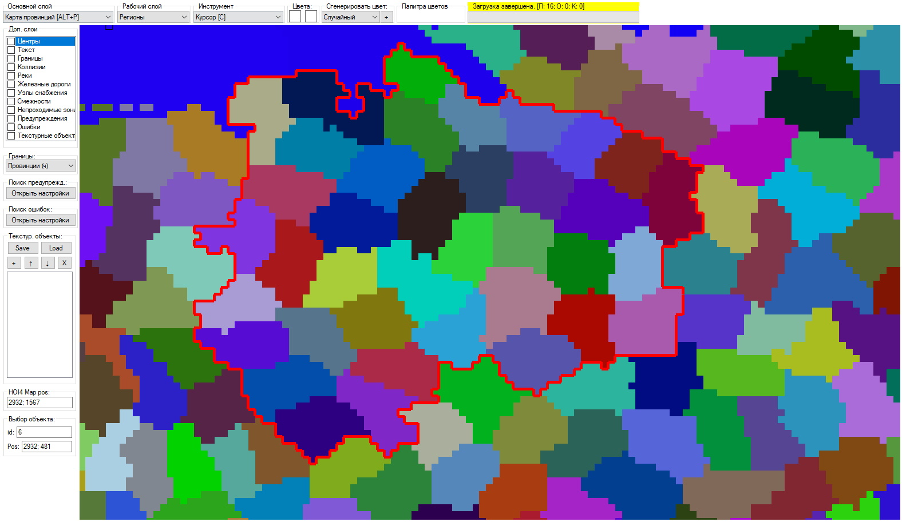
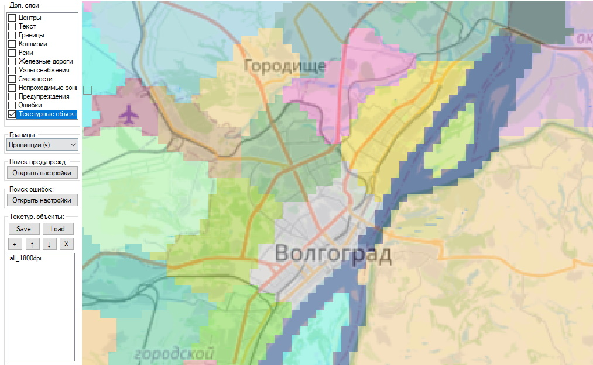
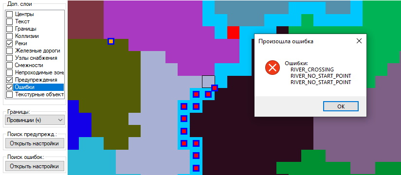

# [🠈](../../lang=ru.md) | Инструмент "Курсор"

Инструмент позволяет выбирать и взаимодействовать с объектами на карте.

Сочетание горячих клавиш: **[C]** \
Используемые параметры: **Отсутствуют** \
Разрешённые рабочие слои: **все слои**

# Доступные действия с инструментом

## Выделение провинций, областей и регионов

В зависимости от выбранного рабочего слоя нажатие ЛКМ и ПКМ по карте будет выделять провинции, области и регионы.

---

Если выбран рабочий слой "Провинции", то при нажатии **[ЛКМ]** по карте будет выбрана та провинция, над которой находится курсор мыши. Красными линиями отображаются границы провинции, а синими квадратами - центры её границ.

Отменить выбор провинции можно нажатием кнопки **[Escape]**. 

ID выбранной провинции будет отображаться в левом нижнем углу интерфейса программы в разделе "Выбор объекта".

---

Если зажать **[SHIFT]** и нажать **[ЛКМ]** по другой провинции, то включится режим группового выделения провинций. Красными линиями будут отображаться внешние границы группы выделенных провинций.

Повторное нажатие **[SHIFT+ЛКМ]** по выделенной провинции в группе снимет выделение с выбранной провинции.

ID выбранных провинций будут отображаться списком в левом нижнем углу интерфейса программы в разделе "Выбор объекта". В качестве символа-разделителя между ID используется пробел.

---

Если нажать **[ПКМ]** по провинции, то её границы стануут выделены оранжевым цветом, а также откроется контекстное меню карты (см. подробнее)

---

Если выбран рабочий слой "Области", нажатие **[ЛКМ]** или **[SHIFT+ЛКМ]** будет выделять не отдельные провинции, а целые области (state).

Повторное нажатие **[SHIFT+ЛКМ]** по выделенной области в группе снимет выделение с выбранной области.

ID выбранной или выбранных областей будут отображаться списком в левом нижнем углу интерфейса программы в разделе "Выбор объекта". В качестве символа-разделителя между ID используется пробел.

---

Если выбран рабочий слой "Регионы", нажатие **[ЛКМ]** или **[SHIFT+ЛКМ]** будет выделять не отдельные провинции, а целые регионы (strategic regions).

Повторное нажатие **[SHIFT+ЛКМ]** по выделенному региону в группе снимет выделение с выбранного региона.

ID выбранного или выбранных регионов будут отображаться списком в левом нижнем углу интерфейса программы в разделе "Выбор объекта". В качестве символа-разделителя между ID используется пробел.

## Перемещения и масштабирование текстурных объектов

Если включено отображение дополнительного слоя текстурных объектов на карте, то при зажатии сочетания клавиш **[CTRL+ЛКМ]** по наложенному на карту текстурному объекту вы сможете перемещать его по карте или менять его размер, вращая **[Колесо мыши]**, не отпуская при этом **[CTRL+ЛКМ]** (см. подробнее в: [Накладываемые текстурные объекты]()).

## Просмотр причин ошибок и предупреждений на карте

Если включено отображение дополнительных слоёв предупреждений (оранжево-синих точек) и/или ошибок (красно-синих точек) на карте, то при нажатии на них ЛКМ будет отображено информационное окно с описанием причин выбранных ошибок и/или предупреждений в указанной курсором мыши точке на карте (см. подробнее в: [Поиск предупреждений и ошибок на карте]())

